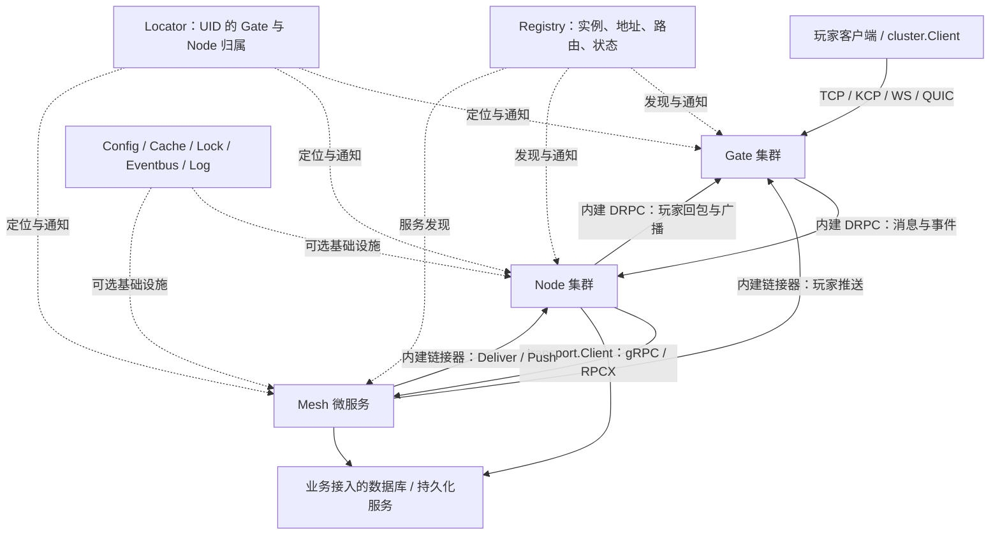
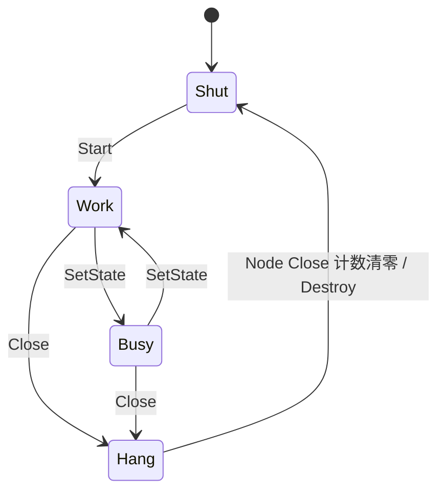
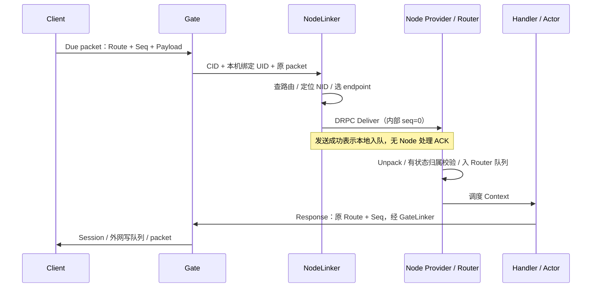
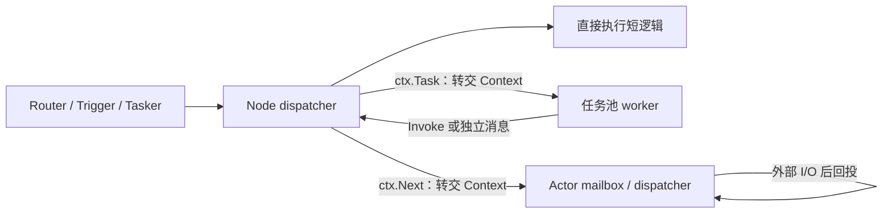

# Due 框架架构设计

## 1. 文档基线与阅读范围

本文面向游戏服务架构师、业务开发者和运维人员，说明 Due 的模块边界、消息路径、状态归属、并发机制和生产部署约束。分析以当前仓库实现为准，开发指南与 README 用作索引；涉及业务拆分、容量规划和演进的内容明确标为建议。

| 项目 | 基线 |
| --- | --- |
| 阅读日期 | 2026-10-08 |
| 框架版本 | `due.Version = v2.6.2` |
| 代码提交 | `853dfa3d0311231c114d7ecfa6de6f2ebab0a03a` |
| 分支 | `v2-feature-main` |
| 根模块 | `github.com/dobyte/due/v2` |
| Go 要求 | 当前根模块与子模块声明 `go 1.27.0` |
| 组织方式 | 多 Go module 单仓库；本次快照包含 30 个 `go.mod` |
| 分析方法 | 静态阅读入口、集群、协议、并发及插件实现，并对照相关回归测试；未执行部署、测试或性能测量 |

文中的“已实现”表示源码中存在相应路径，不等同于对所有故障条件给出保证。README 中的吞吐数字不作为本项目容量预算，旧指南里的默认值也不覆盖当前代码。

## 2. 定位、设计目标与责任边界

Due 是面向实时游戏服务的通信与运行框架。它把玩家连接、业务消息执行、通用微服务和外部基础设施分开，通过容器、接口、路由元数据和可替换实现进行组合。

核心设计可以概括为四个分离：

1. **连接与游戏状态分离**：Gate 管理长连接，Node 管理业务状态；业务服务可以重构和扩展，而不必直接处理 socket。
2. **逻辑寻址与物理连接分离**：业务按 UID、路由、节点 ID 或服务名发起操作，链接器通过定位器和注册中心解析实际地址。
3. **消息执行与外部 I/O 分离**：Node 的串行执行路径适合状态修改，任务池适合并发 I/O，Actor 提供局部状态隔离。
4. **核心接口与供应商实现分离**：注册、定位、配置、缓存、锁、事件、网络和 RPC 可以按部署条件替换。

| 责任 | 框架提供 | 业务工程负责 |
| --- | --- | --- |
| 网络接入 | TCP、KCP、WebSocket、QUIC 连接和回调 | 入口地址、证书、客户端兼容与网关流量调度 |
| 消息处理 | 包格式、路由、编解码接口、Node/Actor 执行路径 | 消息 Schema、路由编号、协议版本、业务错误响应 |
| 用户状态归属 | UID 与 Gate、指定 Node 服务组的绑定关系 | 登录鉴权、唯一登录策略、用户/房间生命周期与迁移 |
| 服务通信 | 内建 DRPC 集群链路及可选 gRPC/RPCX 微服务链路 | 超时预算、幂等、重试策略、服务契约 |
| 状态存储 | 缓存与锁接口及相应实现 | 数据库接入、事务、资产账本、持久化和恢复 |
| 上下线 | 状态发布、关闭钩子、部分任务/会话等待 | 流量摘除、业务排空、停服期限、Kubernetes 等编排 |
| 观测 | 日志、多种输出端、pprof 与基础统计工具 | 指标、追踪、告警、容量与故障演练 |

Due 没有在当前仓库中实现完整的数据库访问层、分布式事务、持久 Actor、自动房间迁移、跨机共识或分布式任务调度服务。`cluster.Master` 是实例类型定义，当前 `cluster/` 下没有与 Gate/Node/Mesh 对等的 Master 组件实现。

源码：[due.go](../../due.go)、[cluster/cluster.go](../../cluster/cluster.go)、[component/component.go](../../component/component.go)。

## 3. 总体架构与通信平面

### 3.1 逻辑视图



图表示逻辑关系，不要求所有项目都部署 Mesh，也不要求每种基础设施都启用。Gate、Node、Mesh 可以在一个进程内组合，也可以作为独立进程部署；同进程组合仍使用各自的组件边界和通信实现，不能据此假定自动切换为函数直调。

### 3.2 三条通信平面

| 平面 | 实现 | 主要负载 | 关键边界 |
| --- | --- | --- | --- |
| 玩家连接平面 | `network` + `packet` | 玩家请求、回包、心跳 | 维护真实连接，受网络写队列与协议大小约束 |
| 集群消息平面 | `internal/link` + `internal/transporter` + DRPC | Gate→Node、Node→Node、Node/Mesh→Gate | 路由与 UID 定位驱动；部分操作是单向入队 |
| 微服务 RPC 平面 | `transport` + gRPC/RPCX | Node/Mesh 等调用注册的服务 | 基于服务描述与服务发现，使用插件的调用/停服语义 |

注册中心和定位器属于控制与寻址基础设施，不承担正常业务消息体转发。`transport/grpc`、`transport/rpcx` 不能直接理解为 Gate→Node 游戏消息通道的可插拔替代品：这条热路径在当前实现中走内建 DRPC。

### 3.3 角色与状态归属

| 角色 | 核心职责 | 进程内状态 | 扩展方式 |
| --- | --- | --- | --- |
| Gate | 连接接入、会话、转发、推送与频道订阅 | socket、CID→Conn、UID→Conn、频道成员 | 增加网关实例承接新连接；已有连接仍归原实例 |
| Node | 路由、事件、业务状态、定时任务、Actor | 路由表、请求队列、Actor、业务内存、绑定用户 | 无状态路由可分流；有状态归属需业务迁移 |
| Mesh | 按服务描述托管微服务 | transport server/client、服务对象、业务自身状态 | 适合不依赖本机玩家会话的服务；状态约束由业务保证 |
| Client | 服务端侧机器人、调试、压测或集群外连接客户端 | 连接、路由回调、事件回调、编解码配置 | 创建多个连接或独立客户端进程 |

Gate 不承载游戏业务状态，但并非完全无状态；Mesh 也不会通过类型系统强制业务无状态。Node 同时支持无状态路由和有状态路由，路由选项才是具体请求的调度依据。

### 3.4 代码组织

```text
due/
├── container.go, due.go         进程生命周期与框架元信息
├── cluster/                    Gate / Node / Mesh / Client 组件
├── network/                    网络接口与四种协议实现
├── packet/                     玩家帧格式与全局 Packer
├── session/                    Gate 本机会话和频道
├── internal/
│   ├── dispatcher/             注册实例到路由/事件表的转换
│   ├── link/                   GateLinker / NodeLinker
│   └── transporter/            Gate / Node 内部服务、DRPC、内部协议
├── transport/                  微服务 Transporter 接口与 gRPC/RPCX
├── core/                       buffer、queue、endpoint、limiter、pool 等
├── task/                       任务池和任务组
├── registry/, locate/          实例发现与用户定位
├── etc/, config/, env/, flag/  启动配置、配置中心与运行输入
├── cache/, lock/, eventbus/    缓存、分布式锁、事件抽象与插件
├── encoding/, crypto/          内容编解码、加解密与签名
├── log/, errors/, codes/       日志、错误链与错误码
├── component/                 通用组件、HTTP、MQTT、pprof
├── utils/                     类型转换、网络、时间、调用等工具
├── benchmark/, testdata/       压测工程、测试和配置样例
└── .harness/                  开发工作流与设计记录
```

根模块承载共享接口和核心实现，子模块按需引入供应商 SDK，减少单一使用者必须拉取的依赖。子模块常通过相对 `replace` 使用本地根模块；版本发布与项目依赖需以兼容提交为单位核对，不能假定所有子模块标签数字相同。

## 4. 应用容器与组件生命周期

### 4.1 组合方式

`component.Component` 定义 `Name / Init / Start / Close / Destroy`，`component.Base` 提供空实现。`Container.Add` 仅按顺序追加组件，不提供依赖图、自动注入、反向关闭或健康探针编排。

`Container.Serve` 的实际执行顺序：


`Serve(true)` 在启动后跳过信号等待并立即进入关闭流程，适用于特定测试或受控运行，不是“启动后立即返回并后台运行”。Windows 监听 `os.Interrupt`，其他平台监听 SIGINT、SIGQUIT、SIGABRT、SIGTERM。

### 4.2 初始化与清理约束

组件初始化通常校验必须注入的插件，失败路径可能调用 `log.Fatal`，而不是把错误返回给 Container。依赖对象及配置应在启动前准备好；Node 路由等注册操作应在允许注册的初始化阶段完成。

关闭阶段并发进行，不保证“先关业务、再关网关”的顺序。Close 等待完成或达到期限后，Container 才发起并发 Destroy；Destroy 总等待窗口固定为 5 秒。之后清理 eventbus、lock、cache、task、config、etc、log 等全局模块。

`etc.shutdownMaxWaitTime` 的真实语义来自 `xcall.Goroutines.Run`：只有设置为正数才创建超时，`0` 在当前实现中表示无额外超时、等待全部 Close 完成。超时只是 Container 停止等待，不会强制取消仍在执行的函数。因此 Close 超时后，尚未完成的 Close 可能与 Destroy 重叠；业务回调需要能承受这种情形。

**部署建议**：设置明确的正数停服预算，业务排空期限应小于该预算，进程编排器的 termination grace period 应更长；避免在单个回调中同步关闭正在执行该回调的网络服务器或连接。

源码：[container.go](../../container.go) 的 `Serve/closeAllComponents/destroyAllComponents`、[utils/xcall/goroutines.go](../../utils/xcall/goroutines.go) 的 `Run`。

### 4.3 集群实例状态



| 状态 | 含义与实际影响 |
| --- | --- |
| `Shut` | 未工作或已销毁；Gate/Node 的主要 provider 操作拒绝此状态 |
| `Work` | 正常工作；无状态路由优先选取 |
| `Busy` | 调度提示；Gate 仍接受新连接，Node 仍可处理请求；无状态路由在没有 Work 时可回退到 Busy |
| `Hang` | 进入关闭阶段；Gate 拒绝新连接，Node 有状态定向路由仍可能到达；不是统一的入站防火墙 |

Work 与 Busy 可通过管理操作切换；Hang 通常由 Close 引入。Node 正常在 Close 等待计数清零后进入 Shut；若提前进入 Destroy，也会将 Hang 转为 Shut 并释放 Close 等待者，这不证明业务收尾已经完成。其余集群组件主要在 Destroy 时进入 Shut，该图不意味着每个组件逐行实现完全相同。状态更新先影响本地，再尝试刷新注册中心；发布失败可能造成远端视图滞后，不构成分布式原子状态切换。

## 5. Gate、会话与用户身份

### 5.1 Gate 的实际构成

Gate 组合一个 `network.Server`、一个 `locate.Locator` 和一个 `registry.Registry`。启动时依次启动玩家网络监听、内建 Gate RPC 服务、注册自身，再开启位置和实例监听。玩家地址与内建 RPC 地址是两种不同的端点，不应混用。

Gate 上没有 Node 那样的游戏路由 handler：接收消息后从 packet 提取路由和序号，把原缓冲区交给 NodeLinker。Gate 一般不反序列化业务消息体，也不承担游戏规则处理。

### 5.2 身份标识

| 标识 | 作用域与作用 |
| --- | --- |
| GID | Gate 实例 ID，用于跨节点找到玩家所连接的网关 |
| CID | 某网关上的连接 ID；跨 Gate 操作需同时提供 GID |
| UID | 业务用户 ID；绑定后可以据此定位 Gate 与不同 Node 服务组 |
| NID | Node 实例 ID；可以显式定向或由 UID 与服务组查询 |
| Node 服务组 | Node 的逻辑名称/注册 Alias；UID 的 Node 归属按此名称区分 |
| Route | 业务路由编号；玩家包通过它选择处理路径 |
| Seq | 消息序号；用于协议层关联响应，不是资产操作的幂等凭据 |
| PID | Node 本地 Actor 标识，后文说明；不是全局分布式 Actor 地址 |

一名用户可以绑定多个不同服务组的 Node，例如 `player` 与 `battle`；同一服务组记录一个当前 NID。服务组改名会改变定位键的语义，应作为兼容性变更处理。

### 5.3 本机会话与绑定流程

`Session` 用锁保护连接表、用户表和频道订阅表。`session.Conn` 以 CID 操作连接；`session.User` 以 UID 操作用户连接。

Gate provider 的 Bind 先更新本机会话，再写 Locator；定位写入失败时会撤销新的本机用户绑定。该过程不是跨本机状态和 Redis 的事务，也不意味着被替换的旧连接能够恢复。业务登录应考虑失败返回和状态补偿。

同一 Gate 内，UID 已绑定另一连接时，新绑定替换旧连接并强制关闭旧连接；断开回调检查用户表仍指向自身，避免旧连接移除新连接的映射。跨 Gate 的覆盖关系依赖 Locator 通知及链接器处理，不能把通知当成严格同步的全局唯一登录锁。

`Connect` 是连接建立事件；`Reconnect` 在 Gate 绑定 UID 成功后触发，也可能出现在首次登录绑定，并不证明框架恢复了断线期间的业务状态。Disconnect 会清理会话、尝试解绑定并通知相关 Node，事件处理属于异步链路。

### 5.4 推送、组播与频道

Session 支持 Push、Multicast、Broadcast、Subscribe、Unsubscribe、Publish。频道成员存储在具体 Gate 的内存中，断开连接时移除；跨 Gate 发布由链接器扇出，不是持久消息订阅系统。

批量发送会共享缓冲区并增加释放计数。返回成功或成功数量通常表示相应入队路径成功，不代表所有玩家已经读取或处理。部分失败应结合成功计数和日志判断；需要业务确认的房间指令或资产通知应另建应用层 ACK/补拉协议。

源码：[cluster/gate/gate.go](../../cluster/gate/gate.go)、[cluster/gate/proxy.go](../../cluster/gate/proxy.go)、[cluster/gate/provider.go](../../cluster/gate/provider.go)、[session/session.go](../../session/session.go)。

## 6. Node、路由与端到端消息链路

### 6.1 Node 的运行时组成

Node 内部包含 Router、Trigger、函数任务队列、Scheduler、Proxy、内建 Node RPC server，以及可选的微服务 transport server。Router 承接业务请求，Trigger 承接连接事件，Scheduler 管理本机 Actor；Proxy 将通信与定位细节封装为业务 API。

Node 可以仅处理无状态请求，也可以承载玩家、房间和战斗状态。是否采用有状态路由、是否转入 Actor、是否执行异步 I/O 是三个独立选择。

### 6.2 路由元数据与选择策略

Node 将注册的路由能力写入 `registry.ServiceInstance.Routes`。Gate/Node 链接器通过发现快照构建路由表，而不是在每次请求时从注册中心查整张表。

| `RouteOptions` 字段 | 已实现机制 | 业务仍需处理 |
| --- | --- | --- |
| `Internal` | 发现路由路径禁止 Gate 调用该路由 | 内网访问控制及业务调用权限 |
| `Stateful` | 以 UID 与 Node 服务组定位 NID；Node provider 再核对实际绑定 | 业务状态创建、加载、迁移及异常恢复 |
| `Authorized` | 发现路由路径要求 UID 非零 | Token 验证、身份真实性、资源权限与风控 |
| `Middlewares` | 按顺序拦截和推进 handler | 请求校验、指标、幂等、错误响应等统一逻辑 |

无状态路由优先从 Work 实例中选择；没有 Work 时回退 Busy；Hang 不参与普通无状态选择。支持 random、rr、wrr，wrr 使用按权重预计算的平滑序列以降低热路径计算。显式 NID 或已绑定 NID 的定向路由可以找到 Work、Busy、Hang 中的目标。

指定 NID 的直连分支不经过所有发现路由策略检查；Node provider 对 Stateful 路由核查位置，但并未把全部 Internal/Authorized 标志当作每次本地执行的统一鉴权器。因此这些选项是路由政策的一部分，不能替代业务鉴权中间件或内网安全。

发现侧路由表以 Route ID 为键，多个实例应对同一编号发布一致的服务组和选项。不同服务组复用同一编号会发生能力混合，而不是得到天然命名空间隔离。**建议**统一管理 Route ID、Schema、服务组和兼容性版本；同组副本发布相同契约。

源码：[cluster/node/router.go](../../cluster/node/router.go)、[cluster/node/provider.go](../../cluster/node/provider.go)、[internal/dispatcher/dispatcher.go](../../internal/dispatcher/dispatcher.go)、[internal/dispatcher/route.go](../../internal/dispatcher/route.go)、[internal/link/node.go](../../internal/link/node.go) 的 `doRPC`。

### 6.3 玩家请求与响应



1. 客户端按 codec 编码消息，可选 payload 加密，再封成 packet；裸 `[]byte` 可跳过序列化。
2. Gate 使用连接对象的 CID/UID，提取 Route/Seq 并转发完整 packet。UID 不由玩家包自行声明。
3. NodeLinker 使用发现路由和用户归属解析 endpoint，按地址取得连接池；Deliver 使用 CID 选择池内连接。
4. Node provider 解包并对 Stateful 校验 `UID + 当前服务组 + 当前 NID`；成功后进入 Router。
5. handler 通过 `Context.Parse` 解密/反序列化；Gate 来源才执行相应公网解密路径。
6. `Response` 复用原 Route/Seq，通常按 GID+CID 回原连接，再由客户端路由回调处理。

`Reply` 不总是回玩家：它按请求来源选择 Gate、源 Actor 或源 Node。`Response` 也不是框架自动维护的同步 Promise；业务要自行决定应答时机、错误格式及超时处理。投递错误可能仅在转发侧记录日志，不自动转换为可供玩家理解的错误包。

入站 Node Context 默认由 `WithContextFunc` 或 `context.Background()` 建立，不自动沿用 provider 的 transport context；调用方的 deadline、取消和 trace 信息需要显式传递或重建。

### 6.4 成功返回和 ACK 的定义

| 操作 | 成功表示 |
| --- | --- |
| 裸 `network.Conn.Push` | 本连接写队列已接纳 Buffer |
| 内部 Node Deliver/Trigger | DRPC 发送队列接纳命令；默认内部 seq=0，不等待 Node ACK |
| Gate 推送 `Ack=false` | 内部发送队列接纳命令 |
| Gate 推送 `Ack=true` | Gate provider 已执行对应会话操作；正常推送是外网写队列接纳 |
| 跨 Gate 多播/广播 `Ack=true` 返回的数量 | 成功接纳推送的会话数量；`Ack=false` 正常返回 0，不提供成功数量，0 不代表未推送 |

以上均不表示玩家已收到、解码或执行业务。对于需要确认的状态变更，业务协议应另设 request ID、应用层 ACK、补拉和去重。公网 Seq、内部 RPC seq、事件 ID 是不同概念，不应共同充当事务提交凭据。

源码：[cluster/client/conn.go](../../cluster/client/conn.go)、[cluster/node/request.go](../../cluster/node/request.go) 的 `Parse/Reply/Response`、[internal/transporter/node/client.go](../../internal/transporter/node/client.go)、[internal/transporter/gate/client.go](../../internal/transporter/gate/client.go)。

## 7. 并发模型、Context 与 Actor

### 7.1 三种模型通过 API 组合

Node 只有一个 `dispatch` goroutine，通过 `select` 消费函数任务、路由请求和事件三个独立队列。同步 handler 在这一执行域串行运行；它不是固定 OS 线程，三个队列之间也不存在统一全序或优先级保证。

| 业务选择 | 实际运行位置 | 合适场景 | 状态访问约束 |
| --- | --- | --- | --- |
| handler 直接处理 | Node dispatcher | 短逻辑、进程内共享状态调度 | 保持所有相关访问在同一执行域 |
| `ctx.Task` | 全局任务池，必要时降级到独立 goroutine | 数据库、HTTP 等并发 I/O | 共享业务数据仍需锁、消息回投或其他同步 |
| `ctx.Next` / `Actor.Next` | 目标 Actor dispatcher | 玩家、房间、战斗的局部状态 | 同 Actor 的消息与函数任务串行，但队列间无统一全序 |

代码没有用于切换 single/multi/actor 的统一模式开关；一个 Node 可同时使用三种方式。Stateful 仅保证节点亲和性，不自动选择 Actor，也不承诺跨请求互斥事务。



### 7.2 Context 是受管理的短生命周期对象

request、event、middleware 使用对象池。Context version 标记执行阶段，避免旧阶段在对象已经转交后重复回收；它不是任意并发读写的安全屏障。

- `ctx.Task` 交出同一个 Context，不自动复制。每个 Context 最多一次 Task，不能与 Next 混用。Task 不返回提交状态，Node 已进入 Shut 时不会调度任务；调用后原 handler 应立即返回，不能依据返回值确认执行。
- `Actor.Next` 成功后 Context 归 mailbox；失败时撤销阶段变更，所有权仍在调用方。成功后不得继续访问或自行释放原 Context。
- `Clone` 复制请求元数据；字节与 Buffer 复制内容，普通对象可能通过 JSON 序列化路径克隆；标准 `context.Context` 引用仍共享。
- Node Context 内部请求消息可能持有池化 Buffer，处理阶段结束时会释放。异步持有 Context 必须采用受支持的转交或复制方式，不能只把接口变量存入业务对象；解析后的业务值是否独立仍需按 codec 和字段类型判断。Client Context 另提供 Data，它返回的内容也受接收 Buffer 生命周期限制。
- 中间件的 `Next` 决定是否推进，不调用可以短路。中间件对象返回后立即回池，不得捕获它供异步调用。
- post-route handler 位于最终回收阶段；Task/Actor 转交后它可能在 worker 或 Actor 执行域运行，不能假设始终属于 Node dispatcher。

**业务建议**：handler 内解析为业务值，短暂修改本执行域状态；慢 I/O 只带必要的值和独立超时，在完成后回投结果，同时检查状态版本和对象是否仍存活。

### 7.3 Actor 的寻址与调度

Actor 的 PID 由 `kind/id` 组成，存于当前 Node Scheduler 的本地表中。每个 Actor 拥有消息 mailbox、函数队列、dispatcher、Processor、用户绑定与处理器。框架没有对应的跨 Node Actor 注册、持久 mailbox 或自动迁移协议。

请求经 Scheduler 按 `Route → Kind`、`UID + Kind → Actor` 定位；同一 UID 可绑定多个 Kind，每个 Kind 对应一个当前 Actor。请求缺少 UID、路由映射或绑定时返回具体错误。

事件 `ctx.Next` 则可扫描可调度 Actors，为注册相应事件的 Actor Clone 后投递，不是自动只发给该 UID 绑定的 Actor。连接事件广播的业务过滤及扇出成本应由业务控制。

多个 Kind 不应竞争同一 Route 的映射。Actor 创建后的动态处理器注册通过任务队列提交，API 返回并不一定意味着路由已生效；需要明确的初始化完成屏障。

### 7.4 Invoke、Timer 与销毁边界

| API | 已实现语义 |
| --- | --- |
| `Proxy.Invoke` | 回 Node 函数队列；默认不等待 |
| `Actor.Invoke` | 回 Actor 函数队列；默认不等待 |
| `ctx.Invoke` | 根据当前 Actor 归属选择执行域 |
| `Invoke(..., true)` | 等待函数完成；同 dispatcher 内检测到自调用则直接执行 |
| `AfterFunc` | timer goroutine 执行，不自动保持 Node/Actor 串行状态约束 |
| `AfterInvoke` | 定时后回到指定 Node/Actor 执行域 |

同队列自等待防护不能解决 Node 与 Actor 互相同步等待的循环；入队超时也不限制已入队函数的执行时长。跨执行域应优先采用异步请求和结果回投。

Actor Init/Start/Destroy 生命周期回调不是全部在 Actor dispatcher 中执行。当前 `Actor.destroy` 关闭队列并清理剩余 Context，但没有 join dispatcher 或等待已运行 handler；Processor.Destroy 可在调用方执行。Node Destroy 也没有自动遍历并销毁所有 Actors。

**业务建议**：先在 Actor 执行域标记业务终结、停止新工作、保存数据并处理状态版本，再由受控路径销毁；不要把 Destroy 当成“mailbox 全部处理完毕”的屏障。Actor 对象及 Timer 都应按一次生命周期管理。

`Actor.Push` 先经 Node Router，携带源 Actor PID；回复定向回发送 Actor。直接 `Actor.Deliver` 不保留该源 PID，防止应答再次反馈同一 Actor。这是异步消息机制，不是自动等待应答的 Actor Ask。

源码：[cluster/node/node.go](../../cluster/node/node.go)、[cluster/node/context.go](../../cluster/node/context.go)、[cluster/node/request.go](../../cluster/node/request.go)、[cluster/node/event.go](../../cluster/node/event.go)、[cluster/node/middleware.go](../../cluster/node/middleware.go)、[cluster/node/scheduler.go](../../cluster/node/scheduler.go)、[cluster/node/actor.go](../../cluster/node/actor.go)、[cluster/node/timer.go](../../cluster/node/timer.go)。

## 8. 玩家协议、网络后端与缓冲区所有权

### 8.1 玩家 packet 格式

默认数据帧：

```text
[size:4][header:1][route:2][seq:2][payload:0..5000]
```

| 字段 | 当前机制 |
| --- | --- |
| size | 不包含自身 4 字节，包含其余头部和 payload |
| byte order | 默认大端，可统一配置为小端 |
| header | bit7 为 heartbeat，bit6 表示心跳时间；普通数据为 0 |
| route | 支持 1、2、4 字节，默认 2 |
| seq | 支持 0、1、2、4 字节，默认 2；0 表示不编码序号 |
| payload | `etc.packet.bufferBytes` / `WithBufferBytes` 限制编码、加密后的正文，默认 5000 字节 |
| heartbeat | `[size:4][header:1]`，可选额外 8 字节服务器时间，默认不带时间 |

默认最大完整数据帧为 5009 字节；5000 是正文上限，不是整个帧上限。默认 2 字节 Route/Seq 的发送检查使用有符号范围，建议协议统一约定非负 `0..32767`；不能据两字节就宣称所有 `uint16` 值都可发送，也不要依赖负值在不同位宽下往返一致。

`packet.Read` 读取完整帧；`ExtractRouteSeq` 只检查和提取；`UnpackMessage` 用 `Slide` 移动 Buffer 视图，并不另复制正文。`packet.SetPacker` 可以替换全局封包逻辑，应在启动前完成配置，所有客户端、Gate 和 Node 采用兼容设置；当前没有协商不同 Packer 版本的通用握手。

Codec 与包格式分开：packet 解决帧边界、路由和序号；codec 解决 payload 对象序列化；Encryptor 解决指定路径中的 payload 加解密。内网传递裸 `[]byte` 的部分路径直接透传并跳过后续加密，不应假定任意 raw byte API 都自动执行相同变换。

源码：[packet/options.go](../../packet/options.go)、[packet/packer.go](../../packet/packer.go)、[packet/packet.go](../../packet/packet.go)、[encoding/codec.go](../../encoding/codec.go)。

### 8.2 四种网络后端的差异

| 后端 | 当前实现特点 | 选择与限制 |
| --- | --- | --- |
| TCP | bufio 解包、独立读写 goroutine、批量 scatter write、TLS/ProxyProtocol 支持 | 成熟长连接方案；需关注队头阻塞与代理配置 |
| KCP | UDP session，支持 MTU、NoDelay、窗口等参数 | 需结合丢包和移动网络测量；当前建连传 nil cipher、FEC=0/0，不是默认加密/FEC |
| WebSocket | HTTP Upgrade、TLS、Origin、压缩；BinaryMessage 解析 Due packet | 适合浏览器；TextMessage 不作为 Due 消息处理，组合 Buffer 发送可能 flatten |
| QUIC | TLS 必需，ALPN `due-quic`，每连接绑定一个双向 stream | 当前不使用 datagram，也不提供多游戏流并行调度；仍需应用层协议 |

TCP 默认最大连接数 5000、写队列 1024、心跳间隔 10 秒、resp 心跳；写超时、授权超时、关闭超时默认 0。其他后端必须按各自 options 核对，不能把 TCP 默认参数直接当全网统一值。

公网服务器可响应式或定时推送心跳；心跳关闭不等于 TCP/QUIC 传输层完全没有保活行为。QUIC 首次 Dial 用心跳宣告 stream，使服务器能够先推送；其 transport keepalive 与应用心跳配置也有独立作用。

授权超时判断是否及时绑定 UID，不替代账号 Token 验证。网络连接的 graceful Close 主要排空写队列后关闭，Force Close 中断底层 I/O；两者都不承诺玩家已处理消息。回调中同步关闭自身执行链可能阻塞，应通过异步受控路径操作。

### 8.3 Buffer 与零拷贝边界

`core/buffer` 包含池化 Bytes、Writer 和组合式 NocopyBuffer。Bytes 使用视图游标，NocopyBuffer 可挂载多个片段，通过 `VisitBytes` 支持分片写出；多片段调用 `Bytes()` 可能分配并合并，因此“减少复制”比“端到端零复制”更准确。

| 边界 | 所有权规则 |
| --- | --- |
| `network.OnReceive` 的 Buffer | 注册的接收方负责释放；没有接收回调时网络层释放 |
| 裸 `network.Conn.Push` 成功 | 所有权交网络层，调用方不能再使用或释放 |
| 裸 `network.Conn.Push` 失败 | 所有权仍在调用方，必须释放 |
| `Session.Push` | 包装层处理会话不存在及裸 Push 失败时的释放 |
| 内部 DRPC Call/Push | 内部层失败路径也可能释放其命令 Buffer；不能套用裸 network 的释放规则再次释放 |
| 广播共享 Buffer | 发送前设置 `Delay(n)`，每个消费者负责一次释放，期间内容必须不变 |

Buffer 的计数原子性不代表支持并发 `Slide/Mount` 等结构修改；挂载裸 slice 不复制，也不替调用者冻结内容。池化连接对象关闭后可能复用，应保留 CID/UID 等值，不长期持有旧连接指针并在关闭后继续操作。

源码：[network/conn.go](../../network/conn.go)、[network/server.go](../../network/server.go)、[core/buffer/buffer.go](../../core/buffer/buffer.go)、[core/buffer/bytes.go](../../core/buffer/bytes.go)、[core/buffer/nocopy_buffer.go](../../core/buffer/nocopy_buffer.go)、[network/quic/writer.go](../../network/quic/writer.go)。

## 9. 内建集群链路与 DRPC

### 9.1 链接器、服务封装与物理连接

NodeLinker/GateLinker 负责实例发现、位置缓存、endpoint 选择、业务 packet 编码及目标服务操作；`internal/transporter/node`、`gate` 将操作封装成内部命令；DRPC 用自定义 TCP 协议承载命令和响应。

Builder 按地址懒创建 Client，并用 singleflight 合并并发建连；不是注册中心每出现一个实例就立即建立全部连接。每个 Client 默认 5 条连接，给定索引按池大小取模，无索引时轮询；玩家 Deliver/Trigger 通常按 CID 选择连接，有助于同 CID 保持同一路径，但不提供跨连接或跨进程全局顺序。

### 9.2 内部帧

```text
[size:4][header:1][command:1][internal seq:8][private payload]
```

内部帧固定大端，正常公共部分含 size 共 14 字节，接收完整帧上限为 16 MiB。公网 Route/Seq 的位宽不会改变这里的命令头；内部 uint64 seq 用于 pending Call 相关性，0 表示无需响应。

| 私有负载 | 示例字段 |
| --- | --- |
| Handshake | Kind + instance ID + epoch |
| Deliver | CID 8 字节 + UID 8 字节 + 完整玩家 packet |
| Push | session kind + target 8 字节 + disconnect 标志 + 完整玩家 packet |
| 结果 | 通常含 uint16 code，部分命令再带计数、地址或状态 |

命令包括 Bind/Unbind、GetIP、IsOnline、Stat、Disconnect、Push/Multicast/Broadcast/Publish、Subscribe/Unsubscribe、Trigger/Deliver、GetState/SetState。握手中的 Kind/ID/epoch 是来源识别与连接恢复信息，不是密码学身份认证。

源码：[internal/transporter/internal/route/route.go](../../internal/transporter/internal/route/route.go)、[internal/transporter/internal/protocol/deliver.go](../../internal/transporter/internal/protocol/deliver.go)、[internal/transporter/internal/protocol/push.go](../../internal/transporter/internal/protocol/push.go)、[internal/transporter/internal/drpc/reader.go](../../internal/transporter/internal/drpc/reader.go)。

### 9.3 执行、超时与恢复

DRPC server 在连接读 goroutine 中顺序执行 Deliver/Trigger 及推送家族命令，其他部分管理操作进入任务池。这既维持一条连接上的命令顺序，也使下游队满时压力回传到 TCP；实际业务 handler 仍由 Node/Actor 执行域决定。

Call 注册 pending，命令入队后等待响应或取消；迟到响应被丢弃并释放。调用超时不撤销已经入队的命令，更不撤销远端副作用。默认 `callTimeout=3s`、`dialTimeout=3s` 是局部配置，不是整个建连、握手、排队、业务执行的硬上限；部分握手及入队等待不受相同 deadline 完整覆盖。

重拨有退避和连接 session 检查，避免旧读写 goroutine 破坏新连接。尚未取出的出站命令可能保留到恢复后发送；已经取出的失败写批次不会自动放回。服务端按 Kind/ID/epoch 暂存剩余响应，同 epoch 在约 1 秒有效窗口内重连可回放；这是一项短期内存恢复优化，不是持久交付。

框架没有由这一链路实现的业务去重日志或 exactly-once 保证。应用层重试需按操作性质分类：查询可重试，写入使用业务 request ID 与幂等存储；超时应视为结果不确定，而不是执行失败的证明。

源码：[internal/transporter/internal/drpc/client.go](../../internal/transporter/internal/drpc/client.go)、[internal/transporter/internal/drpc/client_conn.go](../../internal/transporter/internal/drpc/client_conn.go)、[internal/transporter/internal/drpc/server.go](../../internal/transporter/internal/drpc/server.go)、[internal/transporter/internal/drpc/server_conn.go](../../internal/transporter/internal/drpc/server_conn.go)、[internal/transporter/node/builder.go](../../internal/transporter/node/builder.go)。

## 10. Mesh 与微服务 RPC

### 10.1 Mesh 是服务宿主

Mesh 通过 `Proxy.AddServiceProvider(name, desc, provider)` 在 Shut 阶段登记服务，实现可以来自业务自己的 gRPC service descriptor 或 RPCX service 描述。Init 要求 codec、registry、transporter；Locator 可选，但缺少它时基于 UID 的定位操作受限。

实例注册 Name 为 `mesh`，业务显示名称存于 Alias，`Services` 列出实际微服务名。启动 transport server 后注册实例，客户端根据服务名而非玩家 Route ID 找到 provider。Node 也可注入 Transporter 托管普通服务，因此 Node/Mesh 的区别是职责与生命周期组织，而不是绝对功能隔离。

Mesh Proxy 同时持有 GateLinker/NodeLinker，可向玩家 Push 或向 Node Deliver；这些操作继续走内建 DRPC，不能据此把 Mesh 的所有调用画成 gRPC。

### 10.2 服务发现和均衡

| target 形式 | 行为 |
| --- | --- |
| `direct://host:port` | 地址直连，不要求 Discovery |
| `direct://instance_id` | 依赖发现缓存按 Mesh 实例解析 |
| `discovery://business_service_name` | 订阅 Mesh 实例并按 Services 过滤 |

gRPC/RPCX discovery 按每个业务服务独立采用 `Work > Busy > Hang`：没有 Work/Busy 时仍回退 Hang。它与 Node 无状态路由排除 Hang 的规则不同，Hang 不能单独充当 Mesh 的强制流量隔离措施；direct 实例调用也不遵循上述统一选择。

gRPC 支持随机、轮询、加权轮询、一致性哈希；RPCX 映射到底层选择模式。gRPC 一致性哈希默认按 RPC FullMethodName，不是自动按 UID 的会话亲和性。RPCX 默认 Failtry 也不完成业务幂等。

### 10.3 启停与扩展

Mesh Close 切换 Hang、发布状态并执行 Close hooks，没有自身在途 RPC 计数或禁止新请求的统一门禁。Destroy 才注销并停止 server。gRPC 使用 `GracefulStop`，插件内没有强制截止时间；RPCX Shutdown 使用 5 秒 context。Container 的等待期限不能让阻塞函数自动终止。

Mesh Destroy 不自动关闭注入的 Registry、Locator、Transporter，Container 的全局清理也未覆盖这些注入对象。应用需统一安排客户端和插件生命周期，尤其不能由单个组件提前关闭其他组件仍在使用的共享实例。

gRPC 提供原生 ServerOption/DialOption 扩展点，可安装认证、deadline、指标和追踪拦截器；默认 recovery 不构成完整生产治理。TLS 需完整配置证书/密钥或客户端 CA/ServerName，不是只填一个参数就启用。

**业务建议**：Mesh 适合账号查询、配置计算、匹配入口、排行榜查询和通用业务接口。匹配池、排行榜写入等若持有内存状态，仍须设计分片与恢复，不能因为使用 Mesh 就随意重启。

源码：[cluster/mesh/mesh.go](../../cluster/mesh/mesh.go)、[cluster/mesh/proxy.go](../../cluster/mesh/proxy.go)、[transport/transporter.go](../../transport/transporter.go)、[transport/grpc/transporter.go](../../transport/grpc/transporter.go)、[transport/rpcx/transporter.go](../../transport/rpcx/transporter.go)。

## 11. 服务注册、能力发现与用户定位

### 11.1 Registry 是能力目录

`ServiceInstance` 发布 ID、Name、Kind、Alias、State、Endpoint、Weight、Metadata，以及 Routes、Events、Services。注册中心同时描述地址和能力：Node 的路由/事件、Mesh 的服务描述，都影响调用侧如何选择实例。

`Watcher.Next` 通常返回完整实例快照，链接器通过 `Dispatcher.ReplaceServices` 重建路由、事件与 endpoint 表，用 atomic.Value 发布新表。多个表的独立发布不等于跨表/跨进程原子切换；变更传播仍受发现实现与网络影响。

| 注册实现 | 当前机制 | 一致性与恢复边界 |
| --- | --- | --- |
| etcd | 实例 key + Lease，默认 TTL 15 秒；KeepAlive；revision 连续 watch | 初始/恢复全量拉取、定期校正；通知合并为最新快照，调用端不瞬时同步 |
| Consul | metadata 映射、TCP 检查 + TTL 心跳、passingOnly 健康查询 | blocking query 与退避；有限恢复失败可终止监听，需关注健康状态 |
| Nacos | naming SDK、ephemeral/healthy 实例及订阅 | SDK 心跳与超时；部分 API 不完整透传 Go context |
| Polaris | Provider/Consumer API、实例订阅与权重 | 重复注册兼容；一致性与超时依赖 SDK 和配置 |

etcd watcher 默认约每 5 分钟全量校正；etcd/Consul 的 Services 在 manager 健康时可读本地缓存，而非每次直读远端。注册成功、已开始监听、业务 readiness 是不同条件。

**治理建议**：统一环境 namespace、实例 ID 唯一性、Node 服务组、路由契约和 Mesh 服务名；将 readiness 与注册元数据、入口摘流配合使用。外部插件的 ctx 参数不必然保证所有 SDK 调用都可取消。

源码：[registry/registry.go](../../registry/registry.go)、[registry/etcd/registrar.go](../../registry/etcd/registrar.go)、[registry/etcd/watcher.go](../../registry/etcd/watcher.go)、[registry/consul/registry.go](../../registry/consul/registry.go)、[registry/nacos/registry.go](../../registry/nacos/registry.go)、[registry/polaris/registry.go](../../registry/polaris/registry.go)。

### 11.2 Locator 与发现职责不同

| 信息 | 存储与作用 |
| --- | --- |
| 实例地址/能力 | Registry；回答 NID/GID 对应哪个服务端点 |
| 用户网关归属 | Redis String；回答 UID 当前对应哪个 GID |
| 用户节点归属 | Redis Hash，以 Node 服务组为 field；回答 UID 在某组对应哪个 NID |
| Actor 绑定 | Node 本地 Scheduler；回答 UID+Kind 对应哪个本机 Actor |

Redis BindGate 覆盖 GID并保留已有 TTL，BindNode 覆盖服务组字段；实现不主动为新定位数据设置 TTL。Unbind 使用 Lua 比较 GID/NID 后删除，旧实例不能误删已换绑的新位置；不匹配时无删除，API 仍可能返回 nil。

存储更新后再单独 Pub/Sub 通知，通知失败可能仅记录日志而绑定返回成功。Watcher 容量 1024，满时丢旧事件；断线重订阅不提供历史补放。链接器的本地位置缓存因此是尽力通知更新，并有查询/部分失败再定位路径，不是严格一致的全局会话表。

NodeLinker 观察绑定到本 NID 的用户时登记 Node 关闭等待计数，解绑定或迁出时释放；定位通知质量也会影响局部缓存与停服等待。进程崩溃后，Registry 租约到期不会自动删除所有 Locator 记录。

**业务建议**：登录和迁移使用 session generation 或业务 fencing、明确旧连接踢除与位置校正；为崩溃后的旧绑定设计清理和恢复。定位 Hash 不能替代持久的玩家/房间状态表。

源码：[locate/locator.go](../../locate/locator.go)、[locate/redis/locator.go](../../locate/redis/locator.go)、[locate/redis/script.go](../../locate/redis/script.go)、[locate/redis/watcher.go](../../locate/redis/watcher.go)、[internal/link/gate.go](../../internal/link/gate.go)、[internal/link/node.go](../../internal/link/node.go)。

## 12. 配置体系与基础设施插件

### 12.1 启动配置与动态配置

`etc` 是框架启动参数入口，默认从 `./etc` 的只读文件源加载。配置目录优先级为 `--etc > DUE_ETC > ./etc`；文件名去除扩展名后形成顶层名字，例如 `etc.toml` 对应 `etc.cluster.node.*`。

构造组件时，`defaultOptions` 先读 etc，再依次应用 `With*`，显式 Option 通常覆盖文件值。配置文件变化不自动重建 listener、连接池或队列。`etc.Set` 可改内存视图，但默认文件源不允许持久写回。

`config` 是独立的业务配置中心，支持 File、etcd、Consul、Nacos、Polaris Source，以及 Get/Set/Match/Watch/Load/Store：

- 初始加载按 source 参数顺序，同名配置后加载者覆盖前者；同名 Source 也可能覆盖查询映射。
- Watch 以新事件合并当前视图，不是持续按静态 source 优先级重算；同名内容可能由后到事件覆盖。
- Set 修改内存；Store 才尝试写源，仍受读写模式限制。
- 配置内容支持 JSON/XML/YAML/TOML；它与消息 codec 的支持列表不同。
- 文件 Remove/Rename、空内容及上层配置删除的语义不完整，不应把“动态合并”当作严格快照替换。

运行模式支持 debug、test、pre-release、release，优先级为配置文件 < `DUE_MODE` < `--mode` < `mode.SetMode`。mode 是进程级运行标志，不能代替环境 namespace、权限或部署隔离。

**配置建议**：关键启动参数显式校验；动态参数采用版本化整包、原子应用与失败回滚；明确空值/删除语义，避免同名文件和同名 Source。只有设计了重配置回调的参数才视为可在线调整。

源码：[etc/etc.go](../../etc/etc.go)、[config/configurator.go](../../config/configurator.go)、[config/source.go](../../config/source.go)、[config/options.go](../../config/options.go)、[mode/mode.go](../../mode/mode.go)、[testdata/etc/etc.toml](../../testdata/etc/etc.toml)。

### 12.2 公共接口与实现矩阵

| 模块 | 抽象 | 当前实现与用途 |
| --- | --- | --- |
| registry | Register/Deregister/Services/Watch | etcd、Consul、Nacos、Polaris；能力发现 |
| locate | Bind/Unbind/Locate/Watch | Redis；用户位置 |
| transport | NewServer/NewClient/Discovery | gRPC、RPCX；微服务 |
| config | Source + Configurator | File、etcd、Consul、Nacos、Polaris；配置 |
| cache | Get/Set/GetSet/Delete/计数 | Redis、Memcache；读优化 |
| lock | Maker + Acquire/TryAcquire/Release | Redis、Memcache；跨进程互斥 |
| eventbus | Publish/Subscribe | Process、NATS、Redis、Kafka；事件解耦 |
| encoding | Marshal/Unmarshal | JSON、Proto、MsgPack、XML、YAML、TOML |
| crypto | Encryptor 与 Signer | RSA、ECC；payload 加密及独立签名 |
| log | Logger + Syncer | Console、File、Aliyun、Tencent |
| component | 生命周期与业务代理 | HTTP、MQTT、pprof 等独立组件 |

接口统一不意味着各后端具有相同的超时、取消、持久性和一致性语义。全局便捷入口还带来进程级共享状态；运行时更换全局实例可能关闭旧实例，不是无风险的在线切换协议。

### 12.3 缓存

GetSet 未命中执行加载 callback，同一 Cache 实例内用 singleflight 合并并发加载；不是跨进程防击穿锁。空值 sentinel 和随机过期区间用于降低穿透、集中失效。

缓存结果有字符串及类型转换路径，不保证保持任意 Go 对象原生类型。Redis 与 Memcache 的 TTL/计数语义不同；Memcache 的浮点增减实际转换为整数，不能用它维护精确金额。

**建议**：数据库作为资产与进度的权威来源，明确 cache-aside 失效策略；对热点、空值 TTL 和后端故障降级分别限流，不把缓存命中当作授权或事务成功。

### 12.4 分布式锁

Redis 锁通过 SET NX + TTL 获取，UUID owner token 校验续租与释放；默认租期 3 秒、获取间隔 20 毫秒、自动续租。Acquire 的 ctx 约束获取阶段，不意味着成功持锁后取消 ctx 会自动释放。TryAcquire 传显式正 TTL 时不自动续租。

Memcache 实现采用 Add、CAS 和秒级到期；部分底层 API 不透传 ctx。UUID 是所有权 token，不是递增 fencing token。续租失败或丢锁不会自动停止业务临界区，也没有统一 Lost 通知接口。

**建议**：锁用于限制竞争；交易正确性仍依靠数据库事务、条件写、唯一键、幂等和必要的 fencing。进程暂停或分区后，原执行者与新锁持有者可能并行，不应凭租期推导绝对互斥。

### 12.5 事件总线

公共 `EventHandler func(*Event)` 没有 error 返回或显式 ACK/NACK。事件 ID 只提供标识，不自动完成去重。

| 实现 | 已实现投递方式 | 可靠性边界 |
| --- | --- | --- |
| Process | 进程内异步任务；可均衡到一个订阅者 | 无持久化，无订阅者也可成功返回 |
| NATS | 普通 Publish/Subscribe/QueueSubscribe | 非 JetStream，无持久业务 ACK 或离线补发 |
| Redis 广播 | 写 Stream 后 Pub/Sub 通知 | 普通订阅不回读 Stream，离线广播仍会丢 |
| Redis balance | consumer group、XREADGROUP、XAUTOCLAIM、过期处理 | handler 投递到任务池后即 XACK，未等业务完成 |
| Kafka 广播 | 各 partition 从 newest 消费 | 断线恢复不是完整历史重放 |
| Kafka balance | consumer group；handler 调用后 MarkMessage | panic recovery/业务失败未必重投，与数据库副作用不原子 |

因此不能用共同接口宣称可靠业务至少一次或恰好一次。**建议**关键奖励、支付、结算使用 outbox、幂等消费、明确重试/死信及数据库提交关联；普通总线用于可补拉通知、运营广播和统计解耦。

源码：[cache/cache.go](../../cache/cache.go)、[cache/redis/cache.go](../../cache/redis/cache.go)、[cache/memcache/cache.go](../../cache/memcache/cache.go)、[lock/redis/locker.go](../../lock/redis/locker.go)、[lock/redis/script.go](../../lock/redis/script.go)、[lock/memcache/maker.go](../../lock/memcache/maker.go)、[eventbus/eventbus.go](../../eventbus/eventbus.go)、[eventbus/redis/eventbus.go](../../eventbus/redis/eventbus.go)、[eventbus/redis/consumer.go](../../eventbus/redis/consumer.go)、[eventbus/kafka/consumer.go](../../eventbus/kafka/consumer.go)。

## 13. 队列、背压与容量模型

### 13.1 关键默认值

以下为本次源码基线，实际参数可由配置/Option 覆盖：

| 资源 | 默认值 | 含义 |
| --- | --- | --- |
| Node 函数任务队列 | 4096，写超时 0 | 回到 Node 执行域的任务 |
| Node 路由请求/事件队列 | 各 10240，写超时 0 | 两个独立队列，不共享全序 |
| Actor 函数/消息队列 | 各 1024，写超时 3 秒 | 每 Actor 的局部队列 |
| DRPC 出站连接池 | 每地址 5 条 | 调用方进程各自持有 |
| DRPC 出站命令队列 | 每连接 4096，写超时 0 | 多连接总积压可能远大于 4096 |
| Gate/Node 内建 DRPC server 回包队列 | 每连接 128，写超时 0（实现最低容量 128） | 当前创建 server 未传入上述出站队列参数 |
| DRPC 调用/拨号/故障恢复配置 | 3 秒 / 3 秒 / 5 秒 | 局部时间参数，不是完整端到端硬期限 |
| 默认 task pool | 100000，非阻塞提交 | ants 实现；拒绝时便捷 Add 可降级 goroutine |
| 公网 TCP 写队列 | 1024 | 其他协议各自核对 |

0 写超时表示队满后阻塞等待，不是立即失败。队列的 Done 在消费者取出时归还容量，不代表 handler 已完成；sentinel/Wait 也只是局部队列协议，不是数据库或业务确认。

全局 `task.Add` 在池满或不可用时降级到独立 goroutine，因此 pool size 不是硬并发上限。需要硬限制的数据库/HTTP/交易入口应另设 admission、信号量、任务组限制或业务拒绝策略。

### 13.2 背压传播

```text
Node/Actor 处理变慢
→ 下游消息队列积压或入队阻塞
→ DRPC 读 handler 停顿
→ TCP 接收/发送停顿
→ DRPC 出站队列积压
→ Gate 接收回调停顿
→ 玩家侧延迟、写积压或断线
```

有界队列限制局部内存增长，但链路默认无限入队等待可能拉长整体时延。短时背压有助于保护下游；持续过载应通过业务限流、明确超时和负载反馈治理，不能只增大所有队列。

### 13.3 容量估算与优化取舍

连接成本近似 `调用方进程数 × 已建立的目标地址数 × ConnNum`，另有玩家连接。滚动部署时新旧地址并存，Builder 缓存不等于随发现删除自动淘汰旧 Client，需观察连接增长与回收。

内存预算至少拆分为：连接对象和读写缓冲、队列槽、积压 payload、Actor 对象/队列、业务状态、位置缓存、日志缓冲。队列按条数有界不代表字节预算固定；可用 `积压条数 × 实际平均 payload` 估算动态部分，并按最大值检查尖峰。

串行执行域稳定时需满足到达速率小于处理速率；当平均 handler 耗时升高，继续扩队列只能延后过载暴露。关注 queue wait、handler p95/p99、内外网写阻塞与 GC，而不只看 TPS。

热路径采用缓冲池、请求池、组合 Buffer、批量写、原子发布路由表、分片位置缓存和预计算 wrr。这些手段减少分配、锁竞争与系统调用，同时提高所有权管理、参数治理和生命周期处理的复杂度。

源码：[core/queue/queue.go](../../core/queue/queue.go)、[core/queue/tasker.go](../../core/queue/tasker.go)、[task/pool.go](../../task/pool.go)、[task/options.go](../../task/options.go)、[cluster/node/options.go](../../cluster/node/options.go)、[cluster/node/actor_options.go](../../cluster/node/actor_options.go)、[cluster/gate/options.go](../../cluster/gate/options.go)。

## 14. 停服、滚动更新与状态迁移

### 14.1 各角色的排空范围

| 角色 | Close 阶段 | Destroy 阶段 | 不能据此推导 |
| --- | --- | --- | --- |
| Gate | Hang + 注册刷新，拒绝新连接，等待已有会话断开 | 注销、停止内外网服务、取消 context | 自动迁移旧 socket 或主动让全部玩家离线 |
| Node | Hang + 注册刷新、Close hooks、等待 counter，正常完成后 Shut | 兜底转 Shut、关闭队列/服务、等待 dispatcher、清理 | Close 等全部 Router/Trigger 消息处理完；自动销毁全部 Actor |
| Mesh | Hang + 注册刷新、Close hooks | 注销、停止 transport server、取消 context | 强制摘除所有 RPC、新旧连接无缝迁移 |
| Client | 状态切换与 Close hooks | 关闭连接、清表、取消 context | 默认完整的重登录与业务状态恢复 |

Node counter 包含登记的 Invoke、Node 定时器、ctx.Task、默认 wait Actor、归属本节点的用户；不以入站路由/事件积压量为完成条件。长期用户绑定、未销毁 Actor 或长 Timer 会持续阻塞 Close。Destroy 清理剩余消息与等待者，也不提供业务副作用原子完成屏障。

### 14.2 推荐滚动流程

以下是需由业务与部署系统实现的流程：

1. 启动新实例，核验依赖、服务监听和业务 readiness，再允许承担新业务。
2. 在入口调度/LB/readiness 摘除旧实例；更新 Due 状态并检查发现传播。
3. Node 不再分配新玩家/房间，保留对现有绑定用户的受控服务；Mesh 额外阻断新 RPC，避免 Hang fallback。
4. Close hook 处理存量业务、保存状态、停止长 Timer、解绑/迁移用户、终结 Actor。
5. 在业务期限内核验排空条件；到达总期限时采取明确的降级或断线策略。
6. 由 Destroy 注销并释放资源；检查旧定位、连接和后台任务是否残留。

Gate 扩容主要承接新连接；客户端重连后重新登录和绑定，不自动保留旧 CID。Node 扩容首先改善无状态路由分流，已有 UID→NID 和本地 Actor 不会因新实例加入自动再平衡。

### 14.3 状态迁移协议建议

迁移的最小业务状态机应包含“停止接纳新操作 → 保存一致版本 → 建立新 owner → 条件换绑 → 激活新 owner → 终止旧 owner”。业务需要定义失败回滚、重复执行与超时状态；不能只修改 Redis NID 后就假定两端状态一致。

房间迁移还需协调全体成员的 battle Node 归属和 Actor 绑定；数据库版本/session generation/fencing 应阻止旧 owner 继续写入。进程崩溃后从持久化重建业务与 Actor，再完成重新定位；DRPC 的秒级缓冲回放不承担该恢复任务。

## 15. 故障模型与业务一致性

| 故障 | 框架可见行为/机制 | 推荐业务处理 |
| --- | --- | --- |
| 玩家断线 | Disconnect、会话清理、尝试解绑 Gate | 重登录、恢复会话、快照补拉；不要假定所有断线事件必达 |
| Gate 崩溃 | socket 断开，实例随健康/租约失效 | 重连新 Gate，校正旧 Locator；持久状态放业务侧 |
| Node 崩溃 | 实例下线，本机 Actor/内存状态消失 | 协调器确定新 owner，从持久状态恢复并条件换绑 |
| 位置通知丢失 | 链接器缓存可能过期，部分路径再定位 | generation 校验、主动校正、失效策略 |
| 注册中心不可用 | 新注册/状态传播/发现受影响，缓存可能继续使用 | 受控降级、禁止不确定迁移、观测 stale 状态 |
| Redis 不可用 | 定位、锁、缓存/事件插件按依赖失败 | 区分关键位置与非关键缓存，避免同时放大故障 |
| RPC 超时/断链 | 命令可能已执行或仍在队列 | 视作结果不确定；request ID、查询结果、幂等重试 |
| Queue 满 | 阻塞或写超时；便捷任务池可能降级 | admission、限流、背压指标与明确拒绝 |
| 锁失效/租期到期 | 自动续租不再保证 ownership | 数据库条件写/fencing，避免旧执行者覆盖新结果 |
| 事件消费失败 | 没有共同业务 ACK/NACK 契约 | 关键链路 outbox、幂等、重试和死信 |

游戏一致性应按数据重要性分层：战斗帧与即时表现可按特定恢复策略处理；房间/玩家进度需版本化快照；货币、支付、道具发放必须由持久事务或条件写决定。Actor 串行、Stateful 绑定和分布式锁分别解决执行、寻址和竞争问题，都不能单独提供跨服务交易一致性。

源码：[errors/error.go](../../errors/error.go)、[codes/code.go](../../codes/code.go) 提供错误链、堆栈及错误码工具；业务需定义对玩家的稳定错误契约，不直接暴露内部地址、堆栈或后端错误。

## 16. 典型游戏服务拓扑与状态建模建议

本节是架构建议，不代表仓库已经包含这些业务服务。

### 16.1 从开发单体到生产集群

| 阶段 | 推荐组合 | 需要保持的边界 |
| --- | --- | --- |
| 开发/小型部署 | 一个 Container 中组合 Gate、Node 和管理组件 | 保持消息/状态接口，准备外部 Registry/Locator；同进程不自动消除网络依赖 |
| 玩家与房间分离 | 多 Gate + `player` Node + `battle` Node + 必要 Mesh | UID 分组定位；房间 owner 与全部成员路由保持一致 |
| 大型分区部署 | 按环境/区服/地域分隔 Registry 与定位数据，节点按业务分片 | 跨区调用显式设计，不能用同一 Route 表隐式拼接多个集群 |

扩容指标应按角色选取：Gate 看连接数与网络吞吐，Node 看执行域利用率、队列等待和状态容量，Mesh 看 RPC 延迟与下游饱和度。增加副本不会自动迁走已有连接、用户绑定或 Actor。

### 16.2 玩家、房间与微服务划分

| 业务域 | 推荐载体 | 权威状态与一致性 |
| --- | --- | --- |
| 登录接入 | HTTP/Mesh 或未授权无状态 Node 路由 | 身份验证后由服务端确定 UID，并建立 session generation |
| 玩家在线状态 | `player` Node + Player Actor | 单 owner 修改，持久化进度与恢复版本 |
| 房间/战斗 | `battle` Node + Room Actor | 同房间在同 owner；成员 battle NID 与本地 Actor 绑定一致 |
| 匹配 | Mesh 接口 + 业务自建匹配状态/协调器 | 有内存匹配池时仍需分片和恢复 |
| 资产/支付/背包结算 | 持久服务或业务事务层 | DB 事务、唯一 request ID、幂等与账本 |
| 排行榜 | Mesh 查询 + 业务存储 | 明确写入顺序、聚合延迟和最终一致性 |
| 聊天/房间广播 | Gate 频道 + Node/Mesh | 在线推送可补拉；历史消息另行持久化 |

推荐登录链路：未绑定连接进入公开登录路由 → 服务端验证 Token → 确定 UID 与 generation → BindGate → 协调选定 Node owner/加载状态 → BindNode 与本地 Actor 绑定 → 返回业务快照。框架提供其中的通信和绑定工具，账号校验、owner 选择与一致性控制由业务实现。

Stateful 路由以 UID 定位，Room Actor 以本地 Kind/ID 组织状态，两者不是同一层。将房间成员绑定到同一 battle NID后，还需 Scheduler 用户绑定才能 `ctx.Next` 到房间 Actor；跨 Node 房间操作要经 Node 路由，而不是直接传本地 PID。

### 16.3 部署原则

- 公网只暴露玩家入口、受控 HTTP API；DRPC、注册/定位和管理端点置于受保护内网。
- 生产固定可路由的广告地址或验证随机监听地址的注册可达性；分别管理外网和内网端口。
- Gate 列表/LB 与 readiness 由部署系统维护；客户端需要重连、重登录、状态补拉和协议版本策略。
- 隔离关键定位、锁与非关键缓存的资源预算及前缀；物理共用 Redis 时评估阻塞、容量和共同故障影响。
- 多模块依赖按兼容提交选取并锁定；下游应用不会自动继承仓库的本地 replace。

## 17. 可观测性、附属组件与安全

### 17.1 日志与管理组件现状

日志使用 Logger/Syncer，可输出 Console、File、Aliyun、Tencent，文件支持缓冲、轮转与压缩。默认配置含 Console+File、info 级别；文件默认约 1 秒刷新、32 KiB 缓冲。日志调用不保证将出口写入失败反馈业务，也不等同持久审计账本。

当前 slog 适配的 WithAttrs/WithGroup 返回自身，记录转换不完整保留全部 attrs；接入结构化关联字段时应专项验证。Fatal/Fatalf 调用 `os.Exit(1)`，不会走完整的组件退出流程。

| 组件 | 实现与边界 |
| --- | --- |
| HTTP | Fiber v3、路由/中间件、Swagger、TLS、可信代理；可创建 Mesh client，不自行注册为集群实例；Destroy 有单独 Shutdown 期限 |
| MQTT | mochi-mqtt，TCP/WS、TLS、hooks；独立协议服务，不自动成为 Due packet Gate |
| pprof | 标准 pprof HTTP 路由；当前继承空 Close/Destroy，没有内建鉴权和 server Shutdown |

当前源码没有统一内建的 Prometheus/OpenTelemetry 业务观测链路。可沿 Node middleware、组件 hooks、gRPC interceptors、网络回调和业务状态机接入。

### 17.2 推荐指标

| 层次 | 推荐观察项 |
| --- | --- |
| Gate/network | 活跃连接/UID、接入拒绝、授权超时、断线原因、写队列深度、包大小/吞吐、写阻塞 |
| Node | Router/Trigger/Tasker 积压、入队等待、handler p95/p99、非法路由/位置不匹配 |
| Actor | 存活数、mailbox 积压、单 Actor 热点、处理时间、创建/销毁失败、绑定数 |
| DRPC/transport | 连接池数、建连/握手耗时、pending、超时、重连、迟到响应、扇出失败 |
| Registry/Locator | 续租错误、watch 终止、快照更新时间、通知丢弃、位置校正与旧绑定 |
| Cache/Lock/Eventbus | hit/miss、加载耗时、获取/续租失败、消费滞后、重试/重复/业务失败 |
| 进程/停服 | goroutine/GC/RSS、任务池降级、Close 等待用户/Actor/Timer、阶段耗时 |

request ID、UID、room ID、GID/NID、Route、generation 用于日志和追踪关联；不要把高基数 UID/room ID 直接用作无限增长的指标标签。先度量入队到处理、处理到推送的分段延迟，再定义整体 SLO。

### 17.3 生产安全边界

- DRPC 默认是裸 TCP，Kind/ID 握手不认证调用者。需网络隔离或在受控入口建立认证/加密保护。
- Authorized 表示 UID 非零，不验证 Token。每个业务接口需身份、权限、输入与频率检查；`core/limiter` 提供 token bucket 工具，但不会自动保护所有路由。
- payload Encryptor 与独立 Signer 不自动构成完整的传输认证、签名校验和防重放协议；TLS、业务签名和重放防护分别设计。
- WebSocket Origin 与可信代理范围按实际客户端配置；Forwarded 地址不能直接作为可信用户身份。
- MQTT 没有 auth/ACL 配置时可能安装 AllowHook；debug hook 可输出敏感包信息和密码，生产需明确认证并禁用该调试方式。
- pprof、Swagger、管理 RPC、配置写接口分别收敛访问权限；日志对 Token、凭据及个人数据脱敏。

源码：[log/logger.go](../../log/logger.go)、[log/file/syncer.go](../../log/file/syncer.go)、[component/http/server.go](../../component/http/server.go)、[component/mqtt/server.go](../../component/mqtt/server.go)、[component/pprof/pprof.go](../../component/pprof/pprof.go)、[core/limiter/limiter.go](../../core/limiter/limiter.go)、[crypto/encryptor.go](../../crypto/encryptor.go)、[crypto/signer.go](../../crypto/signer.go)。

## 18. 验证策略与工程约束

### 18.1 现有测试证据

下列测试已阅读，用于核对设计意图；本次文档工作未执行它们，不以阅读结果报告运行通过。

| 测试入口 | 关注点 |
| --- | --- |
| [node_extra_lifecycle_test.go](../../cluster/node/node_extra_lifecycle_test.go) | 生命周期、状态迁移和等待计数 |
| [scheduler_test.go](../../cluster/node/scheduler_test.go) | Actor 用户绑定、并发分片与销毁竞态 |
| [actor_queue_regression_test.go](../../cluster/node/actor_queue_regression_test.go) | mailbox 计数、满队列超时与 timer 分配 |
| [actor_reply_regression_test.go](../../cluster/node/actor_reply_regression_test.go) | Actor 回包避免循环反馈 |
| [request_test.go](../../cluster/node/request_test.go) | Clone、字节复制与缓存回收 |
| [packer_extra_test.go](../../packet/packer_extra_test.go) | 位宽、长度、心跳、错误输入 |
| [drpc/server_test.go](../../internal/transporter/internal/drpc/server_test.go) | 同连接 Deliver 顺序与阻塞背压 |
| [drpc/client_e2e_test.go](../../internal/transporter/internal/drpc/client_e2e_test.go) | Call、Push 与无响应超时 |
| [gate_fanout_test.go](../../internal/link/gate_fanout_test.go) | 广播/发布/多播扇出、计数与释放 |
| [watcher_test.go](../../internal/link/watcher_test.go) | 终止性监听错误后的停止 |
| [nocopy_concurrent_test.go](../../core/buffer/nocopy_concurrent_test.go) | 共享 Buffer 并发扇出与释放 |
| [quic_test.go](../../network/quic/quic_test.go) | 首帧、关闭、所有权、TLS 与短写 |

### 18.2 建议验证层次

1. **模块测试**：协议异常、Buffer 生命周期、路由选项、Context 转交、队列写超时与 Actor 生命周期。
2. **集成测试**：真实 Gate→Node→Client、UID换绑、跨 Gate 推送、不同 Registry/transport 配置。
3. **并发验证**：race 检查、广播共享缓冲、迁移与解绑竞态、销毁与在途 handler、跨执行域调用。
4. **故障演练**：断开 Redis/Registry/DRPC、阻塞握手和写入、重复请求、进程崩溃、watch 恢复与缓存校正。
5. **停服演练**：长期连接、默认 wait Actor、长 Timer、Hang fallback、总期限与强制终止后的恢复。
6. **容量压测**：真实业务 handler、房间分布、慢客户端、payload 大小和下游延迟；记录硬件、Go版本、并发、错误率和尾延迟。

当前 `.github/workflows/go.yml` 使用 Go 1.27.x，在根模块运行 build、test/coverage，并提供 etcd/Consul/Redis。根目录 `go test ./...` 不涵盖嵌套模块，生产质量门禁应逐模块运行适用检查并提供对应中间件。不能以根 coverage 代替所有网络和供应商插件的质量结论。

源码：[.github/workflows/go.yml](../../.github/workflows/go.yml)、[go.mod](../../go.mod)、[network/tcp/go.mod](../../network/tcp/go.mod)、[transport/grpc/go.mod](../../transport/grpc/go.mod)。

## 19. 设计取舍、现状限制与演进方向

### 19.1 主要取舍

| 设计选择 | 收益 | 代价与适用条件 |
| --- | --- | --- |
| Gate 与 Node 分离 | 隔离连接和业务生命周期，支持角色独立扩容 | 增加内部连接、定位与故障恢复复杂度 |
| 自定义 DRPC 热路径 | 轻量命令、批量写、专门的 Buffer 管理 | 自行承担 deadline、安全、版本和可靠性语义 |
| 节点串行 + 局部 Actor | 状态访问容易建立所有权 | 长 handler/同步等待形成队头阻塞和死锁风险 |
| 共享池化 Buffer/Context | 降低分配和 GC 压力 | 转交/回收规则必须严格，异步使用易破坏生命周期 |
| 位置本地缓存 + 通知 | 降低路由时远端读取成本 | 通知丢失、旧位置和主动校正必须治理 |
| 多 module 与接口插件 | 按需引入供应商依赖，组合灵活 | 版本矩阵、多模块 CI 与语义差异管理成本 |
| Hang 排空与绑定路由 | 支持存量业务在旧节点收尾 | 不是全局摘流屏障，需业务与部署系统配合 |

### 19.2 需要专项验证的当前实现点

1. **DRPC GetState 空载荷**：`EncodeGetStateReq` 只写公共头；`ServerConn.read` 当前跳过长度为 0 的私有负载，因此按静态路径该请求不会进入状态 handler。已有 API 不等于完整可用链路，依赖前需复现、修复和回归验证。
2. **端到端 deadline**：Builder 有 DialTimeout 配置，但部分建连/握手和 Call 入队等待没有同一硬截止时间覆盖；应专项验证半开连接、队满和握手不回包。
3. **Actor 终结屏障**：destroy 不等待正在运行的 handler，生命周期回调并非全部串行；需业务终结协议，或后续明确 drain/join 契约。
4. **配置删除与优先级**：动态合并不等于快照替换；Source 同名、删除和空值应有明确可测试语义。
5. **消息可靠性**：DRPC 队列恢复与总线 ACK 不是业务提交确认；关键数据链路应先补幂等、持久化和恢复协议。

前两点的直接代码入口：[protocol/state.go](../../internal/transporter/internal/protocol/state.go)、[drpc/server_conn.go](../../internal/transporter/internal/drpc/server_conn.go)、[node/builder.go](../../internal/transporter/node/builder.go)、[drpc/client_conn.go](../../internal/transporter/internal/drpc/client_conn.go)。本次仅记录静态结论，未修改框架或运行故障复现。

### 19.3 建议演进顺序

- 优先统一协议/Route/服务组契约、幂等和权威状态模型，给关键业务定义成功与结果不确定的处理方式。
- 再补整条消息链路的 deadline、admission、队列/连接指标与业务 trace 传递。
- 将 readiness、强摘流、Actor 终结和停服等待原因变成明确、可观测的协议。
- 增强定位校正、连接缓存回收、配置删除、事件完成确认等基础设施边界。
- 以多模块集成、race、故障和滚动更新演练作为演进验收，而不是仅凭吞吐数字判断架构改善。

## 20. 源码导航与文档维护

| 问题 | 优先阅读位置 |
| --- | --- |
| 进程如何启动与退出 | `container.go`、`component/component.go`、`utils/xcall/goroutines.go` |
| 连接到 UID 怎样绑定 | `cluster/gate/provider.go`、`session/session.go`、`locate/redis/` |
| 某 Route 为何选择该 Node | `cluster/node/router.go`、`internal/link/node.go`、`internal/dispatcher/` |
| handler 在哪个执行域运行 | `cluster/node/node.go`、`request.go`、`actor.go`、`task/pool.go` |
| Actor 为何找不到或不能销毁 | `cluster/node/scheduler.go`、`actor_options.go`、`actor.go` |
| 消息为何成功返回但未到达 | `network/conn.go`、`internal/transporter/{node,gate}/client.go`、DRPC pending/queue |
| 数据包为何溢出或解不开 | `packet/options.go`、`packer.go`、`encoding/`、`crypto/` |
| 超时、重连及内存回收 | `internal/transporter/internal/drpc/`、`core/buffer/`、`core/queue/` |
| Mesh 如何发现与调度 | `cluster/mesh/`、`transport/{grpc,rpcx}/internal/resolver/` |
| 实例发现与位置缓存差异 | `registry/`、`locate/`、`internal/link/` |
| 动态配置为何未生效 | `etc/etc.go`、`config/configurator.go`、组件 `defaultOptions` |
| 缓存、锁、事件保证什么 | `cache/`、`lock/`、`eventbus/` 的具体实现 |

维护本文时先更新代码 SHA、版本及模块基线，再核查通信路径、默认值和接口契约。涉及路由选项、Context/Buffer 所有权、ACK、状态选择、Actor 终结或配置合并的变更，应同步修改对应设计章节和验证场景；业务建议始终与已实现机制分开描述。
