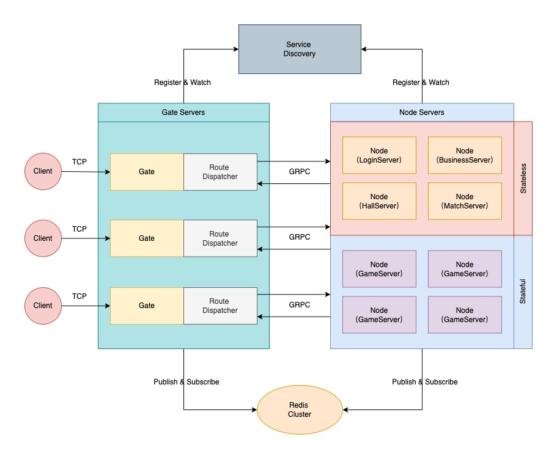

# due 基于Go语言开发的高性能分布式游戏服务器框架

[](https://github.com/dobyte/due/actions)
[](https://goproxy.cn/stats/github.com/dobyte/due/badges/download-count.svg)
[](https://pkg.go.dev/github.com/dobyte/due)
[](https://opensource.org/licenses/MIT)
[](https://goreportcard.com/report/github.com/dobyte/due)

[](https://github.com/avelino/awesome-go)

### 1.介绍

due是一款基于Go语言开发的轻量级、高性能分布式游戏服务器框架。
其中，模块设计方面借鉴了[kratos](https://github.com/go-kratos/kratos)的模块设计思路，旨在为游戏服务器开发提供完善、高效、标准化的解决方案。
框架自创建至今已在多个企业级游戏项目中上线实践过，稳定性有充分的保障。



### 2.优势

* 💡 简单性：架构简单，源码简洁易理解。
* 🚠 便捷性：仅暴露必要的调用接口，减轻开发者的心智负担。
* 🚀 高性能：框架原生实现集群通信方案，普通机器单线程也能轻松实现20W的TPS。
* 🧊 标准化：框架原生提供标准化的开发规范，无论多么复杂的项目也能轻松应对。
* ✈️ 高效性：框架原生提供tcp、kcp、ws等协议的服务器，方便开发者快速构建各种类型的网关服务器。
* ⚖️ 稳定性：所有发布的正式版本均已通过内部真实业务的严格测试，具备较高的稳定性。
* 🎟️ 扩展性：采用良好的接口设计，方便开发者设计实现自有功能。
* 🔑 平滑性：引入信号量，通过控制服务注册中心来实现优雅地滚动更新。
* 🔩 扩容性：通过优雅的路由分发机制，理论上可实现无限扩容。
* 🔧 易调试：框架原生提供了tcp、kcp、ws等协议的客户端，方便开发者进行独立的调试全流程调试。
* 🧰 可管理：提供完善的后台管理接口，方便开发者快速实现自定义的后台管理功能。

### 3.功能

* 网关：支持tcp、kcp、ws等协议的网关服务器。
* 日志：支持std、zap、logrus、aliyun、tencent等多种日志组件。
* 注册：支持consul、etcd、nacos等多种服务注册中心。
* 协议：支持json、protobuf、msgpack等多种通信协议。
* 配置：支持consul、etcd、nacos等多种配置中心；并支持json、yaml、toml、xml等多种文件格式。
* 通信：支持grpc、rpcx等多种高性能通信方案。
* 重启：支持服务器的平滑重启。
* 事件：支持redis、nats、kafka、rabbitMQ等事件总线实现方案。
* 加密：支持rsa、ecc等多种加密方案。
* 服务：支持grpc、rpcx等多种微服务解决方案。
* 灵活：支持单体、分布式等多种架构方案。
* Web：提供http协议的fiber服务器及swagger文档解决方案。
* 工具：提供[due-cli](https://github.com/dobyte/due-cli)脚手架工具箱，可快速构建集群项目。
* 缓存：支持redis、memcache等多种常用的缓存方案。
* Actor：提供完善actor模型解决方案。
* 分布式锁：支持redis、memcache等多种分布式锁解决方案。

### 4.下一期新功能规划

* 高性能日志库

### 5.特殊说明

> 在due交流群中经常有小伙伴提及到Gate、Node、Mesh之间到底是个什么关系，这里就做一个统一的解答

* Gate：网关服，主要用于管理客户端连接，接收客户端的路由消息，并分发路由消息到不同的的Node节点服。
* Node: 节点服，作为整个集群系统的核心组件，主要用于核心逻辑业务的编写。Node节点服务可以根据业务需要做成有状态或无状态的节点，当作为无状态的节点时，Node节点与Mesh微服务基本无异；但当Node节点作为有状态节点时，Node节点便不能随意更新进行重启操作。故而Node与Mesh分离的业务场景的价值就体现出来了。
* Mesh：微服务，主要用于无状态的业务逻辑编写。Mesh能做的功能Node一样可以完成，如何选择完全取决于自身业务场景，开发者可以根据自身业务场景灵活搭配。

### 6.通信协议

在due框架中，通信协议统一采用size+header+route+seq+message的格式：

1.数据包

```
 0 1 2 3 4 5 6 7 0 1 2 3 4 5 6 7 0 1 2 3 4 5 6 7 0 1 2 3 4 5 6 7 0 1 2 3 4 5 6 7 0 1 2 3 4 5 6 7 0 1 2 3 4 5 6 7 0 1 2 3 4 5 6 7 0 1 2 3 4 5 6 7
+---------------------------------------------------------------+-+-------------+-------------------------------+-------------------------------+
|                              size                             |h|   extcode   |             route             |              seq              |
+---------------------------------------------------------------+-+-------------+-------------------------------+-------------------------------+
|                                                                message data ...                                                               |
+-----------------------------------------------------------------------------------------------------------------------------------------------+
```

2.心跳包

```
 0 1 2 3 4 5 6 7 0 1 2 3 4 5 6 7 0 1 2 3 4 5 6 7 0 1 2 3 4 5 6 7 0 1 2 3 4 5 6 7 0 1 2 3 4 5 6 7 0 1 2 3 4 5 6 7 0 1 2 3 4 5 6 7 0 1 2 3 4 5 6 7
+---------------------------------------------------------------+-+-------------+---------------------------------------------------------------+
|                              size                             |h|   extcode   |                      heartbeat time (ns)                      |
+---------------------------------------------------------------+-+-------------+---------------------------------------------------------------+
```

size: 4 bytes

- 包长度位
- 固定长度为4字节，且不可修改

header: 1 bytes

h: 1 bit

- 心跳标识位
- %x0 表示数据包
- %x1 表示心跳包

extcode: 7 bit

- 扩展操作码
- 暂未明确定义具体操作码

route: 1 bytes | 2 bytes | 4 bytes

- 消息路由
- 默认采用2字节，可通过打包器配置packet.routeBytes进行修改
- 不同的路由对应不同的业务处理流程
- 心跳包无消息路由位
- 此参数由业务打包器打包，服务器开发者和客户端开发者均要关心此参数

seq: 0 bytes | 1 bytes | 2 bytes | 4 bytes

- 消息序列号
- 默认采用2字节，可通过打包器配置packet.seqBytes进行修改
- 可通过将打包器配置packet.seqBytes设置为0来屏蔽使用序列号
- 消息序列号常用于请求/响应模型的消息对儿的确认
- 心跳包无消息序列号位
- 此参数由业务打包器packet.Packer打包，服务器开发者和客户端开发者均要关心此参数

message data: n bytes

- 消息数据
- 心跳包无消息数据
- 此参数由业务打包器packet.Packer打包，服务器开发者和客户端开发者均要关心此参数

heartbeat time: 8 bytes

- 心跳数据
- 数据包无心跳数据
- 上行心跳包无需携带心跳数据，下行心跳包默认携带8 bytes的服务器时间（ns），可通过网络库配置进行设置是否携带下行包时间信息
- 此参数由网络框架层自动打包，服务端开发者不关注此参数，客户端开发者需关注此参数

### 7.相关工具链

1.安装protobuf编译器（使用场景：开发mesh微服务）

- Linux, using apt or apt-get, for example:

```shell
$ apt install -y protobuf-compiler
$ protoc --version  # Ensure compiler version is 3+
```

- MacOS, using Homebrew:

```shell
$ brew install protobuf
$ protoc --version  # Ensure compiler version is 3+
```

- Windows, download from [Github](https://github.com/protocolbuffers/protobuf/releases):

2.安装protobuf go代码生成工具（使用场景：开发mesh微服务）

```shell
go install google.golang.org/protobuf/cmd/protoc-gen-go@latest
```

3.安装grpc代码生成工具（使用场景：使用[GRPC](https://grpc.io/)组件开发mesh微服务）

```shell
go install google.golang.org/grpc/cmd/protoc-gen-go-grpc@latest
```

4.安装rpcx代码生成工具（使用场景：使用[RPCX](https://rpcx.io/)组件开发mesh微服务）

```shell
go install github.com/rpcxio/protoc-gen-rpcx@latest
```

5.安装gorm dao代码生成工具（使用场景：使用[GORM](https://gorm.io/)作为数据库orm）

```shell
go install github.com/dobyte/gorm-dao-generator@latest
```

6.安装mongo dao代码生成工具（使用场景：使用[MongoDB](https://github.com/mongodb/mongo-go-driver)作为数据库orm）

```shell
go install github.com/dobyte/mongo-dao-generator@latest
```

### 8.配置中心

1.功能介绍

配置中心主要定位于业务的配置管理，提供快捷灵活的配置方案。支持完善的读取、修改、删除、热更新等功能。

2.支持组件

* [file](config/file/README-ZH.md)
* [etcd](config/etcd/README-ZH.md)
* [consul](config/consul/README-ZH.md)
* [nacos](config/nacos/README-ZH.md)

### 9.注册中心

1.功能介绍

注册中心用于集群实例的服务注册和发现。支撑整个集群的无感知停服、重启、动态扩容等功能。

2.支持组件

* [etcd](registry/etcd/README-ZH.md)
* [consul](registry/consul/README-ZH.md)
* [nacos](registry/nacos/README-ZH.md)

### 10.网络模块

1.功能介绍

网络模块主要以组件的形式集成于网关模块，为网关提供灵活的网络通信支持。

2.支持组件

* [tcp](network/tcp/README-ZH.md)
* [kcp](network/kcp/README-ZH.md)
* [ws](network/ws/README-ZH.md)


### 11.快速开始

下面我们就通过两段简单的代码来体验一下due的魅力，Let's go~~

1.启动组件

```shell
docker-compose up
```

> docker-compose.yaml文件已在docker目录中备好，可以直接取用

2.获取框架

```shell
go get -u github.com/dobyte/due/v2@latest
go get -u github.com/dobyte/due/locate/redis/v2@latest
go get -u github.com/dobyte/due/network/ws/v2@latest
go get -u github.com/dobyte/due/registry/consul/v2@latest
go get -u github.com/dobyte/due/transport/rpcx/v2@latest
```

3.构建Gate服务器

```go
package main

import (
   "github.com/dobyte/due/locate/redis/v2"
   "github.com/dobyte/due/network/ws/v2"
   "github.com/dobyte/due/registry/consul/v2"
   "github.com/dobyte/due/v2"
   "github.com/dobyte/due/v2/cluster/gate"
)

func main() {
   // 创建容器
   container := due.NewContainer()
   // 创建服务器
   server := ws.NewServer()
   // 创建用户定位器
   locator := redis.NewLocator()
   // 创建服务发现
   registry := consul.NewRegistry()
   // 创建网关组件
   component := gate.NewGate(
      gate.WithServer(server),
      gate.WithLocator(locator),
      gate.WithRegistry(registry),
   )
   // 添加网关组件
   container.Add(component)
   // 启动容器
   container.Serve()
}
```

4.启动Gate服务器

```shell
$ go run main.go
                    ____  __  ________
                   / __ \/ / / / ____/
                  / / / / / / / __/
                 / /_/ / /_/ / /___
                /_____/\____/_____/
┌──────────────────────────────────────────────────────┐
| [Website] https://github.com/dobyte/due              |
| [Version] v2.1.0                                     |
└──────────────────────────────────────────────────────┘
┌────────────────────────Global────────────────────────┐
| PID: 27159                                           |
| Mode: debug                                          |
└──────────────────────────────────────────────────────┘
┌─────────────────────────Gate─────────────────────────┐
| Name: gate                                           |
| Link: 172.22.243.151:46545                           |
| Server: [ws] 0.0.0.0:3553                            |
| Locator: redis                                       |
| Registry: consul                                     |
└──────────────────────────────────────────────────────┘
```

5.构建Node服务器

```go
package main

import (
   "fmt"
   "github.com/dobyte/due/locate/redis/v2"
   "github.com/dobyte/due/registry/consul/v2"
   "github.com/dobyte/due/v2"
   "github.com/dobyte/due/v2/cluster/node"
   "github.com/dobyte/due/v2/codes"
   "github.com/dobyte/due/v2/log"
   "github.com/dobyte/due/v2/utils/xtime"
)

const greet = 1

func main() {
   // 创建容器
   container := due.NewContainer()
   // 创建用户定位器
   locator := redis.NewLocator()
   // 创建服务发现
   registry := consul.NewRegistry()
   // 创建节点组件
   component := node.NewNode(
      node.WithLocator(locator),
      node.WithRegistry(registry),
   )
   // 初始化监听
   initListen(component.Proxy())
   // 添加节点组件
   container.Add(component)
   // 启动容器
   container.Serve()
}

// 初始化监听
func initListen(proxy *node.Proxy) {
   proxy.Router().AddRouteHandler(greet, false, greetHandler)
}

type greetReq struct {
   Message string `json:"message"`
}

type greetRes struct {
   Code    int    `json:"code"`
   Message string `json:"message"`
}

func greetHandler(ctx node.Context) {
   req := &greetReq{}
   res := &greetRes{}
   defer func() {
      if err := ctx.Response(res); err != nil {
         log.Errorf("response message failed: %v", err)
      }
   }()

   if err := ctx.Parse(req); err != nil {
      log.Errorf("parse request message failed: %v", err)
      res.Code = codes.InternalError.Code()
      return
   }

   log.Info(req.Message)

   res.Code = codes.OK.Code()
   res.Message = fmt.Sprintf("I'm server, and the current time is: %s", xtime.Now().Format(xtime.DateTime))
}
```

6.启动Node服务器
```shell
$ go run main.go
                    ____  __  ________
                   / __ \/ / / / ____/
                  / / / / / / / __/
                 / /_/ / /_/ / /___
                /_____/\____/_____/
┌──────────────────────────────────────────────────────┐
| [Website] https://github.com/dobyte/due              |
| [Version] v2.1.0                                     |
└──────────────────────────────────────────────────────┘
┌────────────────────────Global────────────────────────┐
| PID: 27390                                           |
| Mode: debug                                          |
└──────────────────────────────────────────────────────┘
┌─────────────────────────Node─────────────────────────┐
| Name: node                                           |
| Link: 172.22.243.151:37901                           |
| Codec: json                                          |
| Locator: redis                                       |
| Registry: consul                                     |
| Encryptor: -                                         |
| Transporter: -                                       |
└──────────────────────────────────────────────────────┘
```

7.构建测试客户端

```go
package main

import (
   "fmt"
   "github.com/dobyte/due/eventbus/nats/v2"
   "github.com/dobyte/due/network/ws/v2"
   "github.com/dobyte/due/v2"
   "github.com/dobyte/due/v2/cluster"
   "github.com/dobyte/due/v2/cluster/client"
   "github.com/dobyte/due/v2/eventbus"
   "github.com/dobyte/due/v2/log"
   "github.com/dobyte/due/v2/utils/xtime"
   "time"
)

const greet = 1

func main() {
   // 初始化事件总线
   eventbus.SetEventbus(nats.NewEventbus())
   // 创建容器
   container := due.NewContainer()
   // 创建客户端组件
   component := client.NewClient(
      client.WithClient(ws.NewClient()),
   )
   // 初始化监听
   initListen(component.Proxy())
   // 添加客户端组件
   container.Add(component)
   // 启动容器
   container.Serve()
}

// 初始化监听
func initListen(proxy *client.Proxy) {
   // 监听组件启动
   proxy.AddHookListener(cluster.Start, startHandler)
   // 监听连接建立
   proxy.AddEventListener(cluster.Connect, connectHandler)
   // 监听消息回复
   proxy.AddRouteHandler(greet, greetHandler)
}

// 组件启动处理器
func startHandler(proxy *client.Proxy) {
   if _, err := proxy.Dial(); err != nil {
      log.Errorf("gate connect failed: %v", err)
      return
   }
}

// 连接建立处理器
func connectHandler(conn *client.Conn) {
   doPushMessage(conn)
}

// 消息回复处理器
func greetHandler(ctx *client.Context) {
   res := &greetRes{}

   if err := ctx.Parse(res); err != nil {
      log.Errorf("invalid response message, err: %v", err)
      return
   }

   if res.Code != 0 {
      log.Errorf("node response failed, code: %d", res.Code)
      return
   }

   log.Info(res.Message)

   time.AfterFunc(time.Second, func() {
      doPushMessage(ctx.Conn())
   })
}

// 推送消息
func doPushMessage(conn *client.Conn) {
   err := conn.Push(&cluster.Message{
      Route: 1,
      Data: &greetReq{
         Message: fmt.Sprintf("I'm client, and the current time is: %s", xtime.Now().Format(xtime.DateTime)),
      },
   })
   if err != nil {
      log.Errorf("push message failed: %v", err)
   }
}

type greetReq struct {
   Message string `json:"message"`
}

type greetRes struct {
   Code    int    `json:"code"`
   Message string `json:"message"`
}
```

8.启动客户端
```shell
$ go run main.go
                    ____  __  ________
                   / __ \/ / / / ____/
                  / / / / / / / __/
                 / /_/ / /_/ / /___
                /_____/\____/_____/
┌──────────────────────────────────────────────────────┐
| [Website] https://github.com/dobyte/due              |
| [Version] v2.1.0                                     |
└──────────────────────────────────────────────────────┘
┌────────────────────────Global────────────────────────┐
| PID: 27801                                           |
| Mode: debug                                          |
└──────────────────────────────────────────────────────┘
┌────────────────────────Client────────────────────────┐
| Name: client                                         |
| Codec: json                                          |
| Protocol: ws                                         |
| Encryptor: -                                         |
└──────────────────────────────────────────────────────┘
INFO[2024/07/03 14:53:08.969845] main.go:72 [I'm server, and the current time is: 2024-07-03 14:53:08]
INFO[2024/07/03 14:53:09.983827] main.go:72 [I'm server, and the current time is: 2024-07-03 14:53:09]
INFO[2024/07/03 14:53:10.986592] main.go:72 [I'm server, and the current time is: 2024-07-03 14:53:10]
INFO[2024/07/03 14:53:11.988530] main.go:72 [I'm server, and the current time is: 2024-07-03 14:53:11]
INFO[2024/07/03 14:53:12.991217] main.go:72 [I'm server, and the current time is: 2024-07-03 14:53:12]
INFO[2024/07/03 14:53:13.995049] main.go:72 [I'm server, and the current time is: 2024-07-03 14:53:13]
```

### 12.压力测试
1.压测机器

```text
Ubuntu 20.04.6 LTS 13th Gen Intel(R) Core(TM) i5-13400F 16GB
```

2.压测结果

```shell
                    ____  __  ________
                   / __ \/ / / / ____/
                  / / / / / / / __/
                 / /_/ / /_/ / /___
                /_____/\____/_____/
┌──────────────────────────────────────────────────────┐
| [Website] https://github.com/dobyte/due              |
| [Version] v2.1.0                                     |
└──────────────────────────────────────────────────────┘
┌────────────────────────Global────────────────────────┐
| PID: 28660                                           |
| Mode: debug                                          |
└──────────────────────────────────────────────────────┘
┌────────────────────────Client────────────────────────┐
| Name: client                                         |
| Codec: json                                          |
| Protocol: tcp                                        |
| Encryptor: -                                         |
└──────────────────────────────────────────────────────┘
server               : tcp
concurrency          : 50
latency              : 4.741343s
data size            : 1.00KB
sent requests        : 1000000
received requests    : 1000000
throughput (TPS)     : 210910
--------------------------------
server               : tcp
concurrency          : 100
latency              : 4.697039s
data size            : 1.00KB
sent requests        : 1000000
received requests    : 1000000
throughput (TPS)     : 212900
--------------------------------
server               : tcp
concurrency          : 200
latency              : 4.447127s
data size            : 1.00KB
sent requests        : 1000000
received requests    : 1000000
throughput (TPS)     : 224864
--------------------------------
server               : tcp
concurrency          : 300
latency              : 5.616742s
data size            : 1.00KB
sent requests        : 1000000
received requests    : 1000000
throughput (TPS)     : 178039
--------------------------------
server               : tcp
concurrency          : 400
latency              : 4.726411s
data size            : 1.00KB
sent requests        : 1000000
received requests    : 1000000
throughput (TPS)     : 211577
--------------------------------
server               : tcp
concurrency          : 500
latency              : 5.054949s
data size            : 1.00KB
sent requests        : 1000000
received requests    : 1000000
throughput (TPS)     : 197825
--------------------------------
server               : tcp
concurrency          : 1000
latency              : 5.486149s
data size            : 1.00KB
sent requests        : 1000000
received requests    : 1000000
throughput (TPS)     : 182277
--------------------------------
server               : tcp
concurrency          : 1000
latency              : 7.753779s
data size            : 2.00KB
sent requests        : 1000000
received requests    : 1000000
throughput (TPS)     : 128969
--------------------------------
```

本测试结果仅供参考，详细测试用例代码请查看[due-benchmark](https://github.com/dobyte/due-benchmark)

### 13.其他组件

1. 日志组件
    * zap: github.com/dobyte/due/log/zap/v2
    * logrus: github.com/dobyte/due/log/logrus/v2
    * aliyun: github.com/dobyte/due/log/aliyun/v2
    * tencent: github.com/dobyte/due/log/zap/v2
2. 网络组件
    * ws: github.com/dobyte/due/network/ws/v2
    * tcp: github.com/dobyte/due/network/tcp/v2
    * kcp: github.com/dobyte/due/network/kcp/v2
3. 注册发现
    * etcd: github.com/dobyte/due/registry/etcd/v2
    * consul: github.com/dobyte/due/registry/consul/v2
    * nacos: github.com/dobyte/due/registry/nacos/v2
4. 传输组件
    * grpc: github.com/dobyte/due/transporter/grpc/v2
    * rpcx: github.com/dobyte/due/transporter/rpcx/v2
5. 定位组件
    * redis: github.com/dobyte/due/locate/redis/v2
6. 事件总线
    * redis: github.com/dobyte/due/eventbus/redis/v2
    * nats: github.com/dobyte/due/eventbus/nats/v2
    * kafka: github.com/dobyte/due/eventbus/kafka/v2
7. Web组件
    * http: github.com/dobyte/due/component/http/v2
8. 配置中心
   * etcd: github.com/dobyte/due/config/etcd/v2
   * consul: github.com/dobyte/due/config/consul/v2
   * nacos: github.com/dobyte/due/config/nacos/v2
9. 缓存组件
   * redis: github.com/dobyte/due/cache/redis/v2
10. 分布式锁组件
    * redis: github.com/dobyte/due/lock/redis/v2

### 14.其他客户端

* [due-client-ts](https://github.com/dobyte/due-client-ts)
* [due-client-shape](https://github.com/dobyte/due-client-shape)

### 15.详细示例

- [due-examples](https://github.com/dobyte/due-examples)
- [due-chat](https://github.com/dobyte/due-chat)
- [due-doudizhu-server](https://github.com/dobyte/due-doudizhu-server) 高性能分布式游戏服务器商业实战案例-斗地主服务器 (付费项目，购买请联系框架作者)

### 16.三方示例

<ul>
   <li style="line-height:30px;padding: 5px 0;">
      <a style="line-height: 30px;float: left;" href="https://github.com/Zekiee" target="_blank"></a>
      <a style="line-height: 30px;float: left;margin-left: 10px;" href="https://github.com/Zekiee/due-game-example">due-game-example</a>
   </li>
   <li style="line-height:30px;padding: 5px 0;">
      <a style="line-height: 30px;float: left;" href="https://github.com/Zekiee" target="_blank"></a>
      <a style="line-height: 30px;float: left;margin-left: 10px;" href="http://47.96.31.184:8089/" target="_blank">蝌蚪聊天室</a>
   </li>
   <li style="line-height:30px;padding: 5px 0;">
      <a style="line-height: 30px;float: left;" href="https://github.com/lingfan" target="_blank"></a>
      <a style="line-height: 30px;float: left;margin-left: 10px;" href="https://github.com/lingfan/due-v2-example" target="_blank">due-v2-example</a>
   </li>
   <li style="line-height:30px;padding: 5px 0;">
      <a style="line-height: 30px;float: left;" href="https://github.com/kk-game" target="_blank"></a>
      <a style="line-height: 30px;float: left;margin-left: 10px;" href="https://github.com/kk-game/due-chat-vue-client" target="_blank">due-chat-vue-client</a>
   </li>
</ul>

### 17.交流与讨论


个人微信：yuebanfuxiao