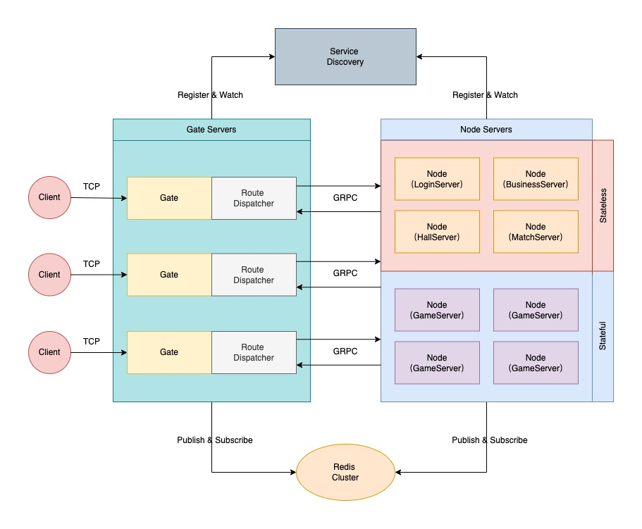

# due — A High-Performance Distributed Game Server Framework in Go


English | [简体中文](README-ZH.md)

[](https://github.com/dobyte/due/actions)
[](https://github.com/dobyte/due)
[](https://pkg.go.dev/github.com/dobyte/due/v2)
[](https://opensource.org/licenses/MIT)
[](https://goreportcard.com/report/github.com/dobyte/due)
[](https://codecov.io/gh/dobyte/due)

[](https://github.com/dobyte/due/releases)


[](https://github.com/dobyte/due/pulls)
[](https://github.com/dobyte/due/pulls?q=is%3Apr+is%3Aclosed)
[](https://github.com/dobyte/due/issues)
[](https://github.com/dobyte/due/issues?q=is%3Aissue+is%3Aclosed)

### 1. Introduction

[due](https://dobyte.github.io/) is a lightweight, high-performance distributed game server framework developed in Go.
Its module design draws on the modular design philosophy of [kratos](https://github.com/go-kratos/kratos), aiming to provide a complete, efficient, elegant, and standardized solution for game server development.
Since its creation, the framework has been deployed and battle-tested in multiple enterprise-level game projects, with stability fully guaranteed.



### 2. Advantages

* 💰 Free: The framework follows the MIT license and is fully open-source and free.
* 💡 Simplicity: Simple architecture with concise, easy-to-understand source code.
* 🚠 Convenience: Only the necessary APIs are exposed, reducing the mental burden on developers.
* 🚀 High performance: The framework natively implements a cluster communication solution; a single thread on an ordinary machine can easily achieve 430K TPS.
* 🧊 Standardization: The framework natively provides standardized development conventions, making even the most complex projects easy to handle.
* ✈️ Efficiency: The framework natively provides tcp, kcp, ws, quic and other servers, making it easy for developers to quickly build various types of gateway servers.
* ⚖️ Stability: All official releases have passed rigorous testing in real internal business scenarios, offering high stability.
* 🎟️ Extensibility: Well-designed interfaces make it easy for developers to design and implement their own features.
* 🔑 Smoothness: Semaphores are introduced to enable graceful rolling updates by controlling the service registry.
* 🔩 Scalability: A graceful route-dispatch mechanism theoretically enables unlimited horizontal scaling.
* 🔧 Easy debugging: The framework natively provides tcp, kcp, ws, quic and other clients, making it easy for developers to perform independent end-to-end debugging.
* 🧰 Manageability: Complete admin APIs make it easy for developers to quickly build custom admin functionality.

### 3. Features

* Gateway: Gateway servers supporting protocols such as tcp, kcp, ws, and quic.
* Logging: Multiple logging components such as console, file, aliyun, and tencent.
* Registry: Multiple service registries such as etcd, consul, nacos, and polaris.
* Protocol: Multiple communication protocols such as json, protobuf, msgpack, xml, yaml, and toml.
* Configuration: Multiple config centers such as file, etcd, consul, nacos, and polaris; also supports file formats such as json, yaml, toml, and xml.
* Communication: Multiple high-performance communication solutions such as grpc and rpcx.
* Restart: Graceful restart of servers.
* Event: Event bus implementations such as process, redis, nats, and kafka.
* Encryption: Multiple encryption and signature schemes such as rsa and ecc.
* Service: Multiple microservice solutions such as grpc and rpcx.
* Flexible: Multiple architecture options such as monolithic and distributed.
* Web: Provides a fiber server for the http protocol and a swagger documentation solution.
* Tooling: Provides the [due-cli](https://github.com/dobyte/due-cli) scaffolding toolbox to quickly build cluster projects.
* Cache: Multiple commonly used caching solutions such as redis and memcache.
* Actor: Provides a complete actor model solution.
* Distributed lock: Multiple distributed lock solutions such as redis and memcache.
* Network: Servers and clients supporting the four protocols tcp, kcp, ws, and quic, with unified heartbeat, authorization, graceful shutdown, and connection management capabilities.

> Next up: a distributed task scheduling system.

### 4. Architecture and Core Concepts

#### 4.1 Components and Container

due adopts a modular "container + component" design. The framework abstracts the gate, node, mesh, cluster client, as well as logging, HTTP, pprof and other capabilities into components (Component), whose lifecycle is orchestrated uniformly by the container (Container):

```go
type Component interface {
    Name() string // component name
    Init()        // initialize the component
    Start()       // start the component
    Close()       // close the component
    Destroy()     // destroy the component
}

func main() {
    container := due.NewContainer() // create a container
    container.Add(component)        // add a component; can be called multiple times
    container.Serve()               // start the container and wait for system signals
}
```

The execution order of `Serve` is: print framework information → `Init` each component in order → `Start` each component in order → write the PID file → wait for system signals → `Close` components concurrently → `Destroy` components concurrently → clean up the PID and global modules.

* Signal handling: Windows listens for `os.Interrupt`; other systems listen for `SIGINT`, `SIGQUIT`, `SIGABRT`, and `SIGTERM`.
* Shutdown timeout: the `Close` phase is controlled by `etc.shutdownMaxWaitTime`; the `Destroy` phase has a fixed 5-second timeout.
* Graceful restart: during the `Close` phase, Gate/Node/Mesh set their own state to `hang` and refresh the instance state in the registry, so that new traffic no longer enters the instance, while waiting for existing sessions and messages to be fully processed. The actual deregistration happens in the `Destroy` phase. Combined with semaphores, this enables rolling updates.

#### 4.2 Instance Kind

| Constant | Value | String | Description |
| --- | --- | --- | --- |
| `cluster.Gate` | 1 | gate | Gateway server |
| `cluster.Node` | 2 | node | Node server |
| `cluster.Mesh` | 3 | mesh | Microservice |
| `cluster.Master` | 4 | master | Admin server |

#### 4.3 Instance State

| Constant | Value | String | Description |
| --- | --- | --- | --- |
| `cluster.Shut` | 0 | shut | Shut down |
| `cluster.Work` | 1 | work | Working |
| `cluster.Busy` | 2 | busy | Busy |
| `cluster.Hang` | 3 | hang | Hanging |

> The gateway accepts new client connections only in the `work` and `busy` states; in all other states it closes the connection immediately.

#### 4.4 Lifecycle Hook

| Constant | Value | Description |
| --- | --- | --- |
| `cluster.Init` | 0 | Initialize the component |
| `cluster.Start` | 1 | Start the component |
| `cluster.Close` | 2 | Close the component |
| `cluster.Destroy` | 3 | Destroy the component |

The node, mesh, and cluster client components can listen to their own lifecycle via `Proxy.AddHookListener(hook, handler)`, which is commonly used for initialization work such as establishing connections after the component starts.

#### 4.5 Event Type

| Constant | Value | Description |
| --- | --- | --- |
| `cluster.Connect` | 1 | Connection opened |
| `cluster.Reconnect` | 2 | Reconnected after disconnection |
| `cluster.Disconnect` | 3 | Connection closed |

#### 4.6 Dispatch Strategy

Load dispatch strategies between cluster instances:

| Constant | Value | Description |
| --- | --- | --- |
| `cluster.Random` | random | Random |
| `cluster.RoundRobin` | rr | Round robin |
| `cluster.WeightedRoundRobin` | wrr | Weighted round robin |

The cluster's internal transport layer (grpc/rpcx) additionally supports a consistent-hash strategy (`ch`), which pins calls with the same request characteristics to the same instance.

#### 4.7 Gate, Node, Mesh, and Client

> Members of the due community frequently ask about the relationship among Gate, Node, and Mesh, so here is a unified explanation.

* Gate: The gateway server, mainly used to manage client connections, receive routed messages from clients, and dispatch routed messages to different Node servers.
* Node: The node server, the core component of the entire cluster system, mainly used to write core business logic. Node services can be stateful or stateless as needed. As a stateless node, a Node is essentially no different from a Mesh microservice; but as a stateful node, a Node cannot be updated and restarted freely. This is where the value of separating Node from Mesh comes in.
* Mesh: The microservice, mainly used to write stateless business logic. Anything Mesh can do, Node can do as well; the choice depends entirely on your own business scenario, and developers can combine them flexibly.
* Client: The cluster client component, which can dial the gateway directly. It is convenient for writing automated tests, stress-test programs, or bot logic within a server project, enabling independent end-to-end debugging.

### 5. Project Structure

```text
due/
├── container.go            Container entry (the only source file in the root package)
├── cluster/                Cluster components
│   ├── cluster.go          Cluster model: Kind/State/Event/Hook/Dispatch and cluster message structures
│   ├── gate/               Gateway component
│   ├── node/               Node component (routing, events, actor model)
│   ├── mesh/               Microservice component
│   └── client/             Cluster client component
├── network/                Network module: tcp, kcp, ws, quic
├── session/                Gateway session management: connection sessions, user sessions, and channel subscriptions
├── packet/                 Communication protocol packing: Packer and Message
├── internal/               Internal implementation: cluster linker, instance dispatcher, intranet RPC protocol
├── registry/               Registries: etcd, consul, nacos, polaris
├── config/                 Config centers: file, etcd, consul, nacos, polaris
├── locate/                 User location: redis
├── transport/              Internal cluster transport: grpc, rpcx
├── eventbus/               Event buses: process, redis, nats, kafka
├── cache/                  Caches: redis, memcache
├── lock/                   Distributed locks: redis, memcache
├── crypto/                 Encryption/decryption and signatures: rsa, ecc
├── encoding/               Codecs: json, proto, msgpack, xml, yaml, toml
├── log/                    Logging: console, file, aliyun, tencent
├── component/              Built-in components: http, mqtt, pprof
├── core/                   Core foundation library: buffer, queue, value, stack, limiter, etc.
├── utils/                  Utility library: xcall, xconv, xnet, xtime, xhash, etc.
├── codes/, errors/         Error codes and error definitions
├── mode/, flag/, env/, etc/  Run mode, command-line flags, environment variables, and startup configuration
├── task/                   Global task pool and task groups
├── docker/                 Middleware orchestration (docker-compose.yaml)
├── benchmark/              Stress-test project (a separate Go module)
└── testdata/               Example configuration and test data
```

### 6. Module List

The framework is published as multiple modules: the core capabilities live in the main module `github.com/dobyte/due/v2`, while pluggable components are each an independent module, making it easy to import them on demand.

| Category | Component | Import Path |
| --- | --- | --- |
| Core | Framework main module | `github.com/dobyte/due/v2` |
| Network | tcp | `github.com/dobyte/due/network/tcp/v2` |
| Network | kcp | `github.com/dobyte/due/network/kcp/v2` |
| Network | ws | `github.com/dobyte/due/network/ws/v2` |
| Network | quic | `github.com/dobyte/due/network/quic/v2` |
| Registry | etcd | `github.com/dobyte/due/registry/etcd/v2` |
| Registry | consul | `github.com/dobyte/due/registry/consul/v2` |
| Registry | nacos | `github.com/dobyte/due/registry/nacos/v2` |
| Registry | polaris | `github.com/dobyte/due/registry/polaris/v2` |
| Config Center | file (built-in) | `github.com/dobyte/due/v2/config/file` |
| Config Center | etcd | `github.com/dobyte/due/config/etcd/v2` |
| Config Center | consul | `github.com/dobyte/due/config/consul/v2` |
| Config Center | nacos | `github.com/dobyte/due/config/nacos/v2` |
| Config Center | polaris | `github.com/dobyte/due/config/polaris/v2` |
| Location | redis | `github.com/dobyte/due/locate/redis/v2` |
| Transport | grpc | `github.com/dobyte/due/transport/grpc/v2` |
| Transport | rpcx | `github.com/dobyte/due/transport/rpcx/v2` |
| Event Bus | process (built-in) | `github.com/dobyte/due/v2/eventbus/process` |
| Event Bus | redis | `github.com/dobyte/due/eventbus/redis/v2` |
| Event Bus | nats | `github.com/dobyte/due/eventbus/nats/v2` |
| Event Bus | kafka | `github.com/dobyte/due/eventbus/kafka/v2` |
| Cache | redis | `github.com/dobyte/due/cache/redis/v2` |
| Cache | memcache | `github.com/dobyte/due/cache/memcache/v2` |
| Distributed Lock | redis | `github.com/dobyte/due/lock/redis/v2` |
| Distributed Lock | memcache | `github.com/dobyte/due/lock/memcache/v2` |
| Crypto | rsa | `github.com/dobyte/due/crypto/rsa/v2` |
| Crypto | ecc | `github.com/dobyte/due/crypto/ecc/v2` |
| Logging | console (built-in) | `github.com/dobyte/due/v2/log/console` |
| Logging | file (built-in) | `github.com/dobyte/due/v2/log/file` |
| Logging | aliyun | `github.com/dobyte/due/log/aliyun/v2` |
| Logging | tencent | `github.com/dobyte/due/log/tencent/v2` |
| Component | http | `github.com/dobyte/due/component/http/v2` |
| Component | mqtt | `github.com/dobyte/due/component/mqtt/v2` |
| Component | pprof (built-in) | `github.com/dobyte/due/v2/component/pprof` |

> Codecs (`encoding/*`), protocol packing (`packet`), the core foundation library (`core/*`), and the utility library (`utils/*`) are all built into the main module and do not need to be imported separately.

### 7. Communication Protocol

In the due framework, the communication protocol uniformly uses the format size+header+route+seq+message:

1. Data packet

```
 0 1 2 3 4 5 6 7 0 1 2 3 4 5 6 7 0 1 2 3 4 5 6 7 0 1 2 3 4 5 6 7 0 1 2 3 4 5 6 7 0 1 2 3 4 5 6 7 0 1 2 3 4 5 6 7 0 1 2 3 4 5 6 7 0 1 2 3 4 5 6 7
+---------------------------------------------------------------+-+-------------+-------------------------------+-------------------------------+
|                              size                             |h|   extcode   |             route             |              seq              |
+---------------------------------------------------------------+-+-------------+-------------------------------+-------------------------------+
|                                                                message data ...                                                               |
+-----------------------------------------------------------------------------------------------------------------------------------------------+
```

2. Heartbeat packet

```
 0 1 2 3 4 5 6 7 0 1 2 3 4 5 6 7 0 1 2 3 4 5 6 7 0 1 2 3 4 5 6 7 0 1 2 3 4 5 6 7 0 1 2 3 4 5 6 7 0 1 2 3 4 5 6 7 0 1 2 3 4 5 6 7 0 1 2 3 4 5 6 7
+---------------------------------------------------------------+-+-------------+---------------------------------------------------------------+
|                              size                             |h|   extcode   |                      heartbeat time (ns)                      |
+---------------------------------------------------------------+-+-------------+---------------------------------------------------------------+
```

size: 4 bytes

- Packet length field
- Fixed at 4 bytes and cannot be modified

header: 1 bytes

h: 1 bit

- Heartbeat flag
- %x0 indicates a data packet
- %x1 indicates a heartbeat packet

extcode: 7 bit

- Extended opcode
- The specific opcodes are not yet clearly defined

route: 1 bytes | 2 bytes | 4 bytes

- Message route
- Defaults to 2 bytes; can be changed via the packer's packet.routeBytes setting
- Different routes correspond to different business handling flows
- Heartbeat packets have no message route field
- This parameter is packed by the business packer; both server and client developers need to care about it

seq: 0 bytes | 1 bytes | 2 bytes | 4 bytes

- Message sequence number
- Defaults to 2 bytes; can be changed via the packer's packet.seqBytes setting
- Set packet.seqBytes to 0 to disable the sequence number
- The message sequence number is commonly used to acknowledge request/response message pairs
- Heartbeat packets have no message sequence number field
- This parameter is packed by the business packer packet.Packer; both server and client developers need to care about it

message data: n bytes

- Message data
- Heartbeat packets have no message data
- This parameter is packed by the business packer packet.Packer; both server and client developers need to care about it

heartbeat time: 8 bytes

- Heartbeat data
- Data packets have no heartbeat data
- Uplink heartbeat packets need not carry heartbeat data; downlink heartbeat packets carry 8 bytes of server time (ns) by default, and whether to include the downlink packet time information can be configured in the network library
- This parameter is packed automatically by the network framework layer; server developers do not need to care about it, but client developers do

### 8. Related Toolchain

1. Install the protobuf compiler (use case: developing mesh microservices)

- Linux, using apt or apt-get, for example:

```shell
$ apt install -y protobuf-compiler
$ protoc --version  # Ensure compiler version is 3+
```

- MacOS, using Homebrew:

```shell
$ brew install protobuf
$ protoc --version  # Ensure compiler version is 3+
```

- Windows, download from [Github](https://github.com/protocolbuffers/protobuf/releases):

2. Install the protobuf Go code generator (use case: developing mesh microservices)

```shell
go install google.golang.org/protobuf/cmd/protoc-gen-go@latest
```

3. Install the grpc code generator (use case: developing mesh microservices with the [GRPC](https://grpc.io/) component)

```shell
go install google.golang.org/grpc/cmd/protoc-gen-go-grpc@latest
```

4. Install the rpcx code generator (use case: developing mesh microservices with the [RPCX](https://rpcx.io/) component)

```shell
go install github.com/rpcxio/protoc-gen-rpcx@latest
```

5. Install the gorm dao code generator (use case: using [GORM](https://gorm.io/) as the database ORM)

```shell
go install github.com/dobyte/gorm-dao-generator@latest
```

6. Install the mongo dao code generator (use case: using [MongoDB](https://github.com/mongodb/mongo-go-driver) as the database ORM)

```shell
go install github.com/dobyte/mongo-dao-generator@latest
```

### 9. Config Center

1. Feature overview

The config center focuses on business configuration management, providing a fast and flexible configuration solution. It supports complete reading, modification, deletion, and hot-reload capabilities.

The core interface is `config.Configurator`, whose main methods are: `Has`, `Get`, `Set`, `Match`, `Watch` (listen for config changes), `Load`, `Store`, and `Close`. Its implementation is decoupled into "config source (Source) + codec (Codec)", so the config file format and the config source are independent of each other.

2. Supported components

* [file](config/file/README-ZH.md)
* [etcd](config/etcd/README-ZH.md)
* [consul](config/consul/README-ZH.md)
* [nacos](config/nacos)
* [polaris](config/polaris/README-ZH.md)

3. Supported config formats

json, yaml (yml), toml, xml.

### 10. Registry

1. Feature overview

The registry is used for service registration and discovery of cluster instances. It underpins capabilities such as imperceptible downtime, restarts, and dynamic scaling of the entire cluster.

The core interface is `registry.Registry`, whose main methods are: `Register`, `Deregister`, `Watch` (listen for instance changes), `Services`, and `Close`; it is accompanied by `registry.Watcher` for consuming instance change events. Instance information is described by `registry.ServiceInstance`, including instance ID, name, kind, state, routes, events, services, endpoint, weight, and metadata.

2. Supported components

* [etcd](registry/etcd/README-ZH.md)
* [consul](registry/consul/README-ZH.md)
* [nacos](registry/nacos)
* [polaris](registry/polaris)

### 11. Network Module

1. Feature overview

The network module is mainly integrated into the gateway module as components, providing the gateway with flexible network communication support. The four protocol implementations share exactly the same interfaces (`network.Server`, `network.Client`, `network.Conn`), so the gateway component can switch freely without modifying business code.

2. Supported protocols

| Protocol | Transport | Underlying dependency | Typical scenario |
| --- | --- | --- | --- |
| [tcp](network/tcp) | TCP | standard net library | Intranet long connections, scenarios with the highest performance requirements |
| [ws](network/ws) | TCP (WebSocket) | gorilla/websocket | Web access from browsers, H5, mini programs, etc. |
| [kcp](network/kcp) | UDP (reliable transport) | xtaci/kcp-go/v5 | Mobile networks, weak-network environments |
| [quic](network/quic/README.md) | UDP (TLS 1.3 multiplexing) | quic-go | Weak networks that require strong security and connection migration |

3. Common capabilities

* Heartbeat detection: supports both `resp` (responsive, driven by client heartbeats) and `tick` (proactively sent by the server on a timer) mechanisms; an interval of 0 disables timed heartbeats.
* Authorization timeout: if the user ID is not bound within the specified time after the connection is established, the connection is closed automatically.
* Graceful shutdown: drains the write queue before closing the connection, with `closeTimeout` limiting the upper bound of the drain wait; forced close interrupts immediately.
* Bounded write queue and write timeout (`writeQueueSize`, `writeTimeout`); when the queue is full, an error is returned according to the write timeout.
* Maximum connection limit (`maxConnNum`), connection ID, user ID binding (`Bind`/`Unbind`), and custom attributes (`Attr`).
* Unified object-pool reuse and sharded connection management, supporting restart after the server stops.
* tcp/ws/kcp support ProxyProtocol; tcp/ws support TLS/HTTPS.

4. Configuration items

The configuration items for each protocol live under `etc.network.<protocol>.server.*` and `etc.network.<protocol>.client.*`, and can also be set via the corresponding `WithServer*`/`WithClient*` functions:

| Configuration Item | tcp | ws | kcp | quic | Description |
| --- | --- | --- | --- | --- | --- |
| addr | :3553 | :3553 | :3553 | :3553 | Listen address |
| maxConnNum | 5000 | 5000 | 5000 | 5000 | Maximum number of connections |
| writeQueueSize | 1024 | 1024 | 1024 | 1024 | Write queue size |
| writeTimeout | 0s | 0s | 0s | 0s | Write timeout; 0 means unlimited |
| heartbeatInterval | 10s | 10s | 10s | 10s | Heartbeat interval |
| heartbeatMechanism | resp | resp | resp | resp | Heartbeat mechanism |
| authorizeTimeout | 0s | 0s | 0s | 0s | Authorization timeout; 0 means no check |
| closeTimeout | 0s | 0s | 0s | 5s | Graceful shutdown drain limit; 0 means unlimited |
| readBufferSize | 4096 | 4096 | - | - | Read buffer size |
| certFile / keyFile | Optional | Optional | - | Required | Certificate and private key |
| enableProxyProtocol | false | - | false | - | Whether to enable ProxyProtocol |
| handshakeTimeout | - | - | - | 5s | QUIC handshake and first-stream wait timeout |
| path | - | / | - | - | WebSocket connection path |
| origins | - | * | - | - | WebSocket cross-origin allowlist |
| writeBufferSize | - | 4096 | - | - | WebSocket write buffer |
| enableCompression | - | false | - | - | Whether to enable compression |
| compressionLevel | - | 1 | - | - | Compression level (1-9) |
| proxyMode | - | none | - | - | Proxy mode: none/transport/application |
| mtu | - | - | 1400 | - | KCP maximum transmission unit |
| noDelay | - | - | [1,10,2,1] | - | KCP no-delay mode parameters |
| windowSize | - | - | [32,32] | - | KCP send/receive window |
| ackNoDelay / writeDelay | - | - | Optional / true | - | KCP ACK and write delay parameters |
| readBuffer / writeBuffer | - | - | Optional | - | KCP socket read/write buffers |

> For protocol-specific parameters not listed in the table, refer to `server_options.go` and `client_options.go` in the corresponding directory.

5. Usage example

```go
// server
server := ws.NewServer(ws.WithServerAddr("0.0.0.0:3553"))
server.OnReceive(func(conn network.Conn, buf buffer.Buffer) {
    defer buf.Release()
    // handle business messages
})
if err := server.Start(); err != nil {
    log.Fatalf("start server failed: %v", err)
}

// client (can be used for independent debugging)
client := ws.NewClient(ws.WithClientUrl("ws://127.0.0.1:3553"))
conn, err := client.Dial()
```

6. Notes

* Buffer ownership: `Push` returning nil means the buffer ownership has been transferred to the network layer, which is responsible for releasing it; when an error is returned, the caller must release it itself. The buffer received by the `OnReceive` callback is the responsibility of the business layer to release.
* When no `OnReceive` callback is registered, received message buffers are released automatically.
* The `Close` semantics of a server connection are "wait for the write queue to drain", and it can be called inside callbacks; however, do not synchronously call the server's `Stop` inside callbacks such as `OnClose`/`OnDisconnect`, to avoid blocking.
* Gateway messages are packed by the `packet` module, and the message body has the structure `route`+`seq`+`message`; see the "Communication Protocol" section for details.


### 12. Quick Start

Below, let's experience the charm of due through two simple code snippets. Let's go~~

1. Start the components

```shell
docker-compose up
```

> The docker-compose.yaml file is already prepared in the docker directory and can be used directly.

2. Get the framework

```shell
go get -u github.com/dobyte/due/v2@latest
go get -u github.com/dobyte/due/locate/redis/v2@latest
go get -u github.com/dobyte/due/network/ws/v2@latest
go get -u github.com/dobyte/due/registry/consul/v2@latest
go get -u github.com/dobyte/due/transport/rpcx/v2@latest
```

3. Build the Gate server

```go
package main

import (
   "github.com/dobyte/due/locate/redis/v2"
   "github.com/dobyte/due/network/ws/v2"
   "github.com/dobyte/due/registry/consul/v2"
   "github.com/dobyte/due/v2"
   "github.com/dobyte/due/v2/cluster/gate"
)

func main() {
   // create a container
   container := due.NewContainer()
   // create a server
   server := ws.NewServer()
   // create a user locator
   locator := redis.NewLocator()
   // create a service discovery
   registry := consul.NewRegistry()
   // create the gate component
   component := gate.NewGate(
      gate.WithServer(server),
      gate.WithLocator(locator),
      gate.WithRegistry(registry),
   )
   // add the gate component
   container.Add(component)
   // start the container
   container.Serve()
}
```

4. Start the Gate server

```shell
$ go run main.go
                    ____  __  ________
                   / __ \/ / / / ____/
                  / / / / / / / __/
                 / /_/ / /_/ / /___
                /_____/\____/_____/
┌──────────────────────────────────────────────────────┐
| [Website] https://github.com/dobyte/due              |
| [Version] v2.1.0                                     |
└──────────────────────────────────────────────────────┘
┌────────────────────────Global────────────────────────┐
| PID: 27159                                           |
| Mode: debug                                          |
└──────────────────────────────────────────────────────┘
┌─────────────────────────Gate─────────────────────────┐
| Name: gate                                           |
| Link: 172.22.243.151:46545                           |
| Server: [ws] 0.0.0.0:3553                            |
| Locator: redis                                       |
| Registry: consul                                     |
└──────────────────────────────────────────────────────┘
```

5. Build the Node server

```go
package main

import (
   "fmt"
   "github.com/dobyte/due/locate/redis/v2"
   "github.com/dobyte/due/registry/consul/v2"
   "github.com/dobyte/due/v2"
   "github.com/dobyte/due/v2/cluster/node"
   "github.com/dobyte/due/v2/codes"
   "github.com/dobyte/due/v2/log"
   "github.com/dobyte/due/v2/utils/xtime"
)

const greet = 1

func main() {
   // create a container
   container := due.NewContainer()
   // create a user locator
   locator := redis.NewLocator()
   // create a service discovery
   registry := consul.NewRegistry()
   // create the node component
   component := node.NewNode(
      node.WithLocator(locator),
      node.WithRegistry(registry),
   )
   // initialize listeners
   initListen(component.Proxy())
   // add the node component
   container.Add(component)
   // start the container
   container.Serve()
}

// initialize listeners
func initListen(proxy *node.Proxy) {
   proxy.Router().AddRouteHandler(greet, false, greetHandler)
}

type greetReq struct {
   Message string `json:"message"`
}

type greetRes struct {
   Code    int    `json:"code"`
   Message string `json:"message"`
}

func greetHandler(ctx node.Context) {
   req := &greetReq{}
   res := &greetRes{}
   defer func() {
      if err := ctx.Response(res); err != nil {
         log.Errorf("response message failed: %v", err)
      }
   }()

   if err := ctx.Parse(req); err != nil {
      log.Errorf("parse request message failed: %v", err)
      res.Code = codes.InternalError.Code()
      return
   }

   log.Info(req.Message)

   res.Code = codes.OK.Code()
   res.Message = fmt.Sprintf("I'm server, and the current time is: %s", xtime.Now().Format(xtime.DateTime))
}
```

6. Start the Node server
```shell
$ go run main.go
                    ____  __  ________
                   / __ \/ / / / ____/
                  / / / / / / / __/
                 / /_/ / /_/ / /___
                /_____/\____/_____/
┌──────────────────────────────────────────────────────┐
| [Website] https://github.com/dobyte/due              |
| [Version] v2.1.0                                     |
└──────────────────────────────────────────────────────┘
┌────────────────────────Global────────────────────────┐
| PID: 27390                                           |
| Mode: debug                                          |
└──────────────────────────────────────────────────────┘
┌─────────────────────────Node─────────────────────────┐
| Name: node                                           |
| Link: 172.22.243.151:37901                           |
| Codec: json                                          |
| Locator: redis                                       |
| Registry: consul                                     |
| Encryptor: -                                         |
| Transporter: -                                       |
└──────────────────────────────────────────────────────┘
```

7. Build the test client

```go
package main

import (
   "fmt"
   "github.com/dobyte/due/eventbus/nats/v2"
   "github.com/dobyte/due/network/ws/v2"
   "github.com/dobyte/due/v2"
   "github.com/dobyte/due/v2/cluster"
   "github.com/dobyte/due/v2/cluster/client"
   "github.com/dobyte/due/v2/eventbus"
   "github.com/dobyte/due/v2/log"
   "github.com/dobyte/due/v2/utils/xtime"
   "time"
)

const greet = 1

func main() {
   // initialize the event bus
   eventbus.SetEventbus(nats.NewEventbus())
   // create a container
   container := due.NewContainer()
   // create the client component
   component := client.NewClient(
      client.WithClient(ws.NewClient()),
   )
   // initialize listeners
   initListen(component.Proxy())
   // add the client component
   container.Add(component)
   // start the container
   container.Serve()
}

// initialize listeners
func initListen(proxy *client.Proxy) {
   // listen for component start
   proxy.AddHookListener(cluster.Start, startHandler)
   // listen for connection establishment
   proxy.AddEventListener(cluster.Connect, connectHandler)
   // listen for message replies
   proxy.AddRouteHandler(greet, greetHandler)
}

// component start handler
func startHandler(proxy *client.Proxy) {
   if _, err := proxy.Dial(); err != nil {
      log.Errorf("gate connect failed: %v", err)
      return
   }
}

// connection establishment handler
func connectHandler(conn *client.Conn) {
   doPushMessage(conn)
}

// message reply handler
func greetHandler(ctx *client.Context) {
   res := &greetRes{}

   if err := ctx.Parse(res); err != nil {
      log.Errorf("invalid response message, err: %v", err)
      return
   }

   if res.Code != 0 {
      log.Errorf("node response failed, code: %d", res.Code)
      return
   }

   log.Info(res.Message)

   time.AfterFunc(time.Second, func() {
      doPushMessage(ctx.Conn())
   })
}

// push a message
func doPushMessage(conn *client.Conn) {
   err := conn.Push(&cluster.Message{
      Route: 1,
      Data: &greetReq{
         Message: fmt.Sprintf("I'm client, and the current time is: %s", xtime.Now().Format(xtime.DateTime)),
      },
   })
   if err != nil {
      log.Errorf("push message failed: %v", err)
   }
}

type greetReq struct {
   Message string `json:"message"`
}

type greetRes struct {
   Code    int    `json:"code"`
   Message string `json:"message"`
}
```

8. Start the client
```shell
$ go run main.go
                    ____  __  ________
                   / __ \/ / / / ____/
                  / / / / / / / __/
                 / /_/ / /_/ / /___
                /_____/\____/_____/
┌──────────────────────────────────────────────────────┐
| [Website] https://github.com/dobyte/due              |
| [Version] v2.1.0                                     |
└──────────────────────────────────────────────────────┘
┌────────────────────────Global────────────────────────┐
| PID: 27801                                           |
| Mode: debug                                          |
└──────────────────────────────────────────────────────┘
┌────────────────────────Client────────────────────────┐
| Name: client                                         |
| Codec: json                                          |
| Protocol: ws                                         |
| Encryptor: -                                         |
└──────────────────────────────────────────────────────┘
INFO[2024/07/03 14:53:08.969845] main.go:72 [I'm server, and the current time is: 2024-07-03 14:53:08]
INFO[2024/07/03 14:53:09.983827] main.go:72 [I'm server, and the current time is: 2024-07-03 14:53:09]
INFO[2024/07/03 14:53:10.986592] main.go:72 [I'm server, and the current time is: 2024-07-03 14:53:10]
INFO[2024/07/03 14:53:11.988530] main.go:72 [I'm server, and the current time is: 2024-07-03 14:53:11]
INFO[2024/07/03 14:53:12.991217] main.go:72 [I'm server, and the current time is: 2024-07-03 14:53:12]
INFO[2024/07/03 14:53:13.995049] main.go:72 [I'm server, and the current time is: 2024-07-03 14:53:13]
```

### 13. Stress Test

1. Test machine

```text
CentOS Linux release 7.9.2009 (Core) Intel(R) Core(TM) i5-10400F CPU @ 2.90GHz 16GB
```

2. Test results

```shell
[root@localhost client]# go run main.go
                    ____  __  ________
                   / __ \/ / / / ____/
                  / / / / / / / __/
                 / /_/ / /_/ / /___
                /_____/\____/_____/
┌──────────────────────────────────────────────────────┐
| [Website] https://github.com/dobyte/due              |
| [Version] v2.6.0                                     |
└──────────────────────────────────────────────────────┘
┌────────────────────────Global────────────────────────┐
| Go: v1.27.1                                          |
| PID: 8633                                            |
| Mode: debug                                          |
| Time: 2026-09-29 15:54:21.971024326 +0800 CST        |
└──────────────────────────────────────────────────────┘
┌────────────────────────Client────────────────────────┐
| Name: client                                         |
| Codec: json                                          |
| Protocol: tcp                                        |
| Encryptor: -                                         |
└──────────────────────────────────────────────────────┘

======================== TCP BENCHMARK =========================
  Concurrency: 50    ｜ Requests: 1000000   ｜ Size: 1.00KB
================================================================
  Protocol:            tcp
  Target:              127.0.0.1:3553
  Duration:            2.291s
-------------------------- Throughput --------------------------
  TPS:                 436,539 req/s
  Bandwidth:           852.62 MB/s
------------------------- Latency (ms) -------------------------
  Min:                 1.498
  Max:                 1396.541
  Avg:                 650.975
  StdDev:              305.887
  P50:                 627.583
  P75:                 884.668
  P90:                 1082.049
  P95:                 1154.118
  P99:                 1264.693
  P999:                1366.872
------------------------- Reliability --------------------------
  Success Rate:        100.00%
  Sent:                1,000,000
  Recv:                1,000,000
  Dial Errors:         0
  Push Errors:         0
-------------------------- Connection --------------------------
  Connections:         50
  Conn Avg (ms):       0.046
  Conn Max (ms):       0.173
  Conn Min (ms):       0.032
============================= END ==============================


======================== TCP BENCHMARK =========================
  Concurrency: 100   ｜ Requests: 1000000   ｜ Size: 1.00KB
================================================================
  Protocol:            tcp
  Target:              127.0.0.1:3553
  Duration:            2.283s
-------------------------- Throughput --------------------------
  TPS:                 437,939 req/s
  Bandwidth:           855.35 MB/s
------------------------- Latency (ms) -------------------------
  Min:                 5.969
  Max:                 1770.038
  Avg:                 811.930
  StdDev:              351.658
  P50:                 763.519
  P75:                 1102.115
  P90:                 1300.236
  P95:                 1371.283
  P99:                 1585.904
  P999:                1759.603
------------------------- Reliability --------------------------
  Success Rate:        100.00%
  Sent:                1,000,000
  Recv:                1,000,000
  Dial Errors:         0
  Push Errors:         0
-------------------------- Connection --------------------------
  Connections:         100
  Conn Avg (ms):       0.090
  Conn Max (ms):       4.691
  Conn Min (ms):       0.031
============================= END ==============================


======================== TCP BENCHMARK =========================
  Concurrency: 200   ｜ Requests: 1000000   ｜ Size: 1.00KB
================================================================
  Protocol:            tcp
  Target:              127.0.0.1:3553
  Duration:            2.339s
-------------------------- Throughput --------------------------
  TPS:                 427,598 req/s
  Bandwidth:           835.15 MB/s
------------------------- Latency (ms) -------------------------
  Min:                 9.657
  Max:                 1981.886
  Avg:                 886.721
  StdDev:              301.629
  P50:                 855.687
  P75:                 1071.851
  P90:                 1324.838
  P95:                 1426.373
  P99:                 1572.181
  P999:                1705.806
------------------------- Reliability --------------------------
  Success Rate:        100.00%
  Sent:                1,000,000
  Recv:                1,000,000
  Dial Errors:         0
  Push Errors:         0
-------------------------- Connection --------------------------
  Connections:         200
  Conn Avg (ms):       0.063
  Conn Max (ms):       5.115
  Conn Min (ms):       0.030
============================= END ==============================


======================== TCP BENCHMARK =========================
  Concurrency: 300   ｜ Requests: 1000000   ｜ Size: 1.00KB
================================================================
  Protocol:            tcp
  Target:              127.0.0.1:3553
  Duration:            2.323s
-------------------------- Throughput --------------------------
  TPS:                 430,426 req/s
  Bandwidth:           840.68 MB/s
------------------------- Latency (ms) -------------------------
  Min:                 2.273
  Max:                 1850.397
  Avg:                 921.112
  StdDev:              404.675
  P50:                 813.360
  P75:                 1246.872
  P90:                 1529.042
  P95:                 1619.543
  P99:                 1755.219
  P999:                1796.587
------------------------- Reliability --------------------------
  Success Rate:        100.00%
  Sent:                1,000,000
  Recv:                1,000,000
  Dial Errors:         0
  Push Errors:         0
-------------------------- Connection --------------------------
  Connections:         300
  Conn Avg (ms):       0.068
  Conn Max (ms):       8.204
  Conn Min (ms):       0.030
============================= END ==============================


======================== TCP BENCHMARK =========================
  Concurrency: 400   ｜ Requests: 1000000   ｜ Size: 1.00KB
================================================================
  Protocol:            tcp
  Target:              127.0.0.1:3553
  Duration:            2.377s
-------------------------- Throughput --------------------------
  TPS:                 420,635 req/s
  Bandwidth:           821.55 MB/s
------------------------- Latency (ms) -------------------------
  Min:                 0.090
  Max:                 1984.112
  Avg:                 955.078
  StdDev:              401.069
  P50:                 831.472
  P75:                 1272.140
  P90:                 1566.748
  P95:                 1695.086
  P99:                 1795.673
  P999:                1868.726
------------------------- Reliability --------------------------
  Success Rate:        100.00%
  Sent:                1,000,000
  Recv:                1,000,000
  Dial Errors:         0
  Push Errors:         0
-------------------------- Connection --------------------------
  Connections:         400
  Conn Avg (ms):       0.038
  Conn Max (ms):       0.089
  Conn Min (ms):       0.028
============================= END ==============================


======================== TCP BENCHMARK =========================
  Concurrency: 500   ｜ Requests: 1000000   ｜ Size: 1.00KB
================================================================
  Protocol:            tcp
  Target:              127.0.0.1:3553
  Duration:            2.361s
-------------------------- Throughput --------------------------
  TPS:                 423,609 req/s
  Bandwidth:           827.36 MB/s
------------------------- Latency (ms) -------------------------
  Min:                 0.734
  Max:                 1944.819
  Avg:                 924.394
  StdDev:              390.023
  P50:                 839.361
  P75:                 1260.052
  P90:                 1460.320
  P95:                 1542.330
  P99:                 1763.011
  P999:                1864.589
------------------------- Reliability --------------------------
  Success Rate:        100.00%
  Sent:                1,000,000
  Recv:                1,000,000
  Dial Errors:         0
  Push Errors:         0
-------------------------- Connection --------------------------
  Connections:         500
  Conn Avg (ms):       0.040
  Conn Max (ms):       0.178
  Conn Min (ms):       0.030
============================= END ==============================


======================== TCP BENCHMARK =========================
  Concurrency: 1000  ｜ Requests: 1000000   ｜ Size: 1.00KB
================================================================
  Protocol:            tcp
  Target:              127.0.0.1:3553
  Duration:            2.416s
-------------------------- Throughput --------------------------
  TPS:                 413,840 req/s
  Bandwidth:           808.28 MB/s
------------------------- Latency (ms) -------------------------
  Min:                 22.929
  Max:                 1972.892
  Avg:                 1016.835
  StdDev:              389.471
  P50:                 947.336
  P75:                 1355.980
  P90:                 1579.272
  P95:                 1653.502
  P99:                 1791.817
  P999:                1893.650
------------------------- Reliability --------------------------
  Success Rate:        100.00%
  Sent:                1,000,000
  Recv:                1,000,000
  Dial Errors:         0
  Push Errors:         0
-------------------------- Connection --------------------------
  Connections:         1000
  Conn Avg (ms):       0.045
  Conn Max (ms):       6.264
  Conn Min (ms):       0.028
============================= END ==============================


======================== TCP BENCHMARK =========================
  Concurrency: 1000  ｜ Requests: 1000000   ｜ Size: 2.00KB
================================================================
  Protocol:            tcp
  Target:              127.0.0.1:3553
  Duration:            3.433s
-------------------------- Throughput --------------------------
  TPS:                 291,295 req/s
  Bandwidth:           1137.87 MB/s
------------------------- Latency (ms) -------------------------
  Min:                 11.012
  Max:                 3285.505
  Avg:                 1401.591
  StdDev:              602.899
  P50:                 1300.200
  P75:                 1898.127
  P90:                 2265.678
  P95:                 2373.526
  P99:                 2689.950
  P999:                2963.444
------------------------- Reliability --------------------------
  Success Rate:        100.00%
  Sent:                1,000,000
  Recv:                1,000,000
  Dial Errors:         0
  Push Errors:         0
-------------------------- Connection --------------------------
  Connections:         1000
  Conn Avg (ms):       0.038
  Conn Max (ms):       0.350
  Conn Min (ms):       0.029
============================= END ==============================
```

These test results are for reference only. For the detailed test case code, see [due-benchmark](https://github.com/dobyte/due/benchmark).

### 14. Other Components

1. Logging components
    * file: github.com/dobyte/due/v2/log/file
    * console: github.com/dobyte/due/v2/log/console
    * aliyun: github.com/dobyte/due/log/aliyun/v2
    * tencent: github.com/dobyte/due/log/tencent/v2
2. Network components
    * ws: github.com/dobyte/due/network/ws/v2
    * tcp: github.com/dobyte/due/network/tcp/v2
    * kcp: github.com/dobyte/due/network/kcp/v2
    * quic: github.com/dobyte/due/network/quic/v2
3. Registry and discovery
    * etcd: github.com/dobyte/due/registry/etcd/v2
    * consul: github.com/dobyte/due/registry/consul/v2
    * nacos: github.com/dobyte/due/registry/nacos/v2
    * polaris: github.com/dobyte/due/registry/polaris/v2
4. Transport components
    * grpc: github.com/dobyte/due/transport/grpc/v2
    * rpcx: github.com/dobyte/due/transport/rpcx/v2
5. Location components
    * redis: github.com/dobyte/due/locate/redis/v2
6. Event buses
    * redis: github.com/dobyte/due/eventbus/redis/v2
    * nats: github.com/dobyte/due/eventbus/nats/v2
    * kafka: github.com/dobyte/due/eventbus/kafka/v2
    * process: github.com/dobyte/due/v2/eventbus/process
7. Common components
    * http: github.com/dobyte/due/component/http/v2
    * pprof: github.com/dobyte/due/v2/component/pprof
    * mqtt: github.com/dobyte/due/component/mqtt/v2
8. Config centers
    * file: github.com/dobyte/due/v2/config/file
    * etcd: github.com/dobyte/due/config/etcd/v2
    * consul: github.com/dobyte/due/config/consul/v2
    * nacos: github.com/dobyte/due/config/nacos/v2
    * polaris: github.com/dobyte/due/config/polaris/v2
9. Cache components
    * redis: github.com/dobyte/due/cache/redis/v2
    * memcache: github.com/dobyte/due/cache/memcache/v2
10. Distributed lock components
    * redis: github.com/dobyte/due/lock/redis/v2
    * memcache: github.com/dobyte/due/lock/memcache/v2
11. Encryption/decryption components
    * rsa: github.com/dobyte/due/crypto/rsa/v2
    * ecc: github.com/dobyte/due/crypto/ecc/v2

> For the complete module list of each component, see "6. Module List".

### 15. Other Clients

* [due-client-ts](https://github.com/dobyte/due-client-ts)
* [due-client-shape](https://github.com/dobyte/due-client-shape)

### 16. Detailed Examples

- [due-examples](https://github.com/dobyte/due-examples)
- [due-chat](https://github.com/dobyte/due-chat)
- [due-doudizhu-server](https://github.com/dobyte/due-doudizhu-desc) A high-performance distributed game server commercial case study — the Doudizhu (Fight the Landlord) server (a paid project; contact the framework author to purchase)

### 17. Third-party Examples

<ul>
   <li style="line-height:30px;padding: 5px 0;">
      <a style="line-height: 30px;float: left;" href="https://github.com/Zekiee" target="_blank"></a>
      <a style="line-height: 30px;float: left;margin-left: 10px;" href="https://github.com/Zekiee/due-game-example">due-game-example</a>
   </li>
   <li style="line-height:30px;padding: 5px 0;">
      <a style="line-height: 30px;float: left;" href="https://github.com/Zekiee" target="_blank"></a>
      <a style="line-height: 30px;float: left;margin-left: 10px;" href="http://47.96.31.184:8089/" target="_blank">Tadpole Chat Room</a>
   </li>
   <li style="line-height:30px;padding: 5px 0;">
      <a style="line-height: 30px;float: left;" href="https://github.com/lingfan" target="_blank"></a>
      <a style="line-height: 30px;float: left;margin-left: 10px;" href="https://github.com/lingfan/due-v2-example" target="_blank">due-v2-example</a>
   </li>
   <li style="line-height:30px;padding: 5px 0;">
      <a style="line-height: 30px;float: left;" href="https://github.com/kk-game" target="_blank"></a>
      <a style="line-height: 30px;float: left;margin-left: 10px;" href="https://github.com/kk-game/due-chat-vue-client" target="_blank">due-chat-vue-client</a>
   </li>
</ul>

### 18. FAQ

1. Inconsistent versions between the framework's main module and submodules

   Reason: Because the framework uses a modular design, each module has its own version number, and the main module's version number is the basis for all submodule version numbers. Therefore, when using the framework, you need to make sure that the main module and submodule versions are consistent; otherwise, unexpected problems may occur.

   For example: the due main module version is v2.3.2, while the lock/redis submodule version is v2.0.0-20250902100831-0402c3a6689f, which causes a version inconsistency.

   ```text
   github.com/dobyte/due/v2 v2.3.2
   github.com/dobyte/due/lock/redis/v2 v2.0.0-20250902100831-0402c3a6689f
   ```

   Solution:

   1. Go to the [release](https://github.com/dobyte/due/releases) page and find the commit corresponding to the framework's released version: 93262b5.

   2. Run `go get github.com/dobyte/due/lock/redis/v2@93262b5` to fetch the submodule corresponding to the current main module version.

   3. The problem is now resolved.

2. Environment requirements

   The framework's main module requires Go 1.27 or later. In addition, the framework uses a multi-module design; submodules are not downloaded together with the main module and need to be imported on demand via `go get` (see "6. Module List" for import paths).

3. Message buffer ownership

   Message buffers in the network layer are allocated from a memory pool by default. The buffer ownership conventions for `Push` and `OnReceive` are as follows:

   * `Push` returns nil: the buffer ownership has been transferred to the network layer, which is responsible for releasing it; the business layer must not use or release the buffer again.
   * `Push` returns an error: the buffer still belongs to the caller, who must release it; otherwise, a memory leak will occur.
   * Buffer in the `OnReceive` callback: it is the responsibility of the business layer to release; when this callback is not registered, the framework releases it automatically.

   Note that the message body returned by `UnpackMessage` shares memory with the receive buffer (zero-copy). If you need to keep the message body after the callback returns (for example, for asynchronous processing, forwarding, or echoing), you must copy it first (e.g. with `bytes.Clone`) before using it; otherwise, that memory may have already been reclaimed and reused.

4. Behavior when a gateway/node is closed

   The gateway component's `Close` uses "wait for sessions to drain" semantics: it first sets its own state to `hang` and refreshes the registry, then waits for online sessions to exit naturally before proceeding to `Destroy`. Therefore, when there are many long connections, `Close` may take a long time; this is by design. If you need to stop the service quickly, you can first disconnect or force-close connections through the admin API.

5. Notes on calling Close/Stop inside callbacks

   Synchronously calling the server's `Stop` or a connection's `Close` inside a network callback may cause blocking; it is recommended to call it in a separate goroutine, or execute it asynchronously through mechanisms such as `AfterFunc`.


### 19. Communication and Discussion


Personal WeChat: yuebanfuxiao
