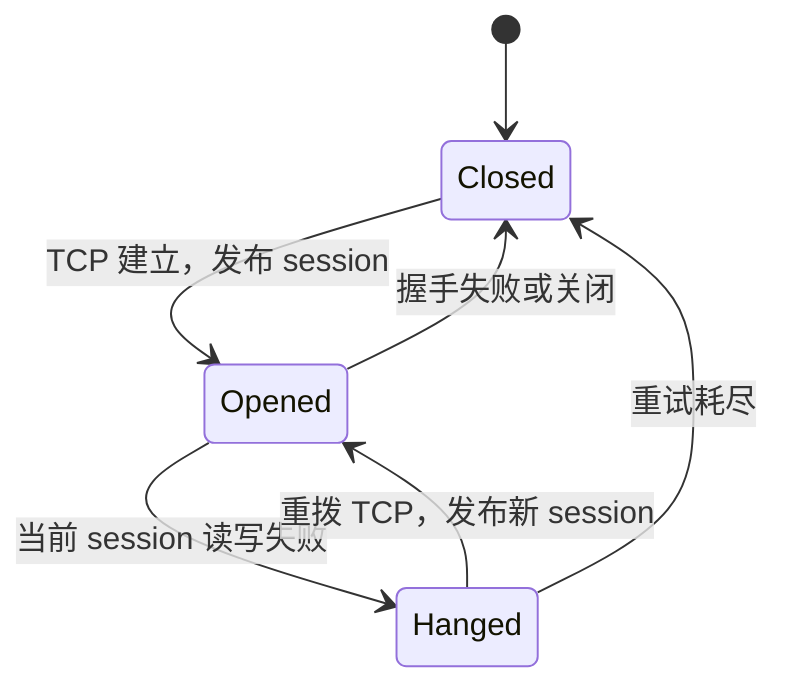
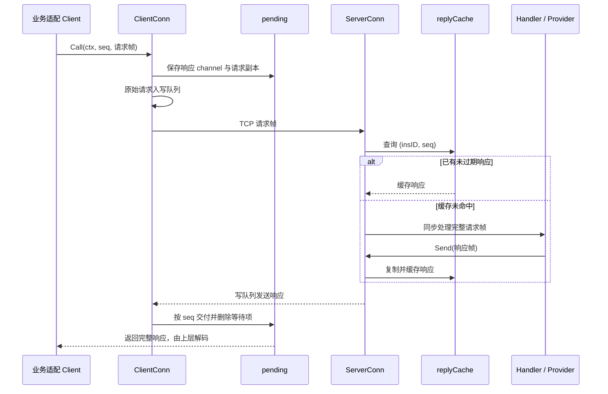

# DRPC 整体架构设计方案

本文基于 2026-09-08 工作区中的实际代码整理，包含尚未提交的实现。阅读范围覆盖 drpc 全部 Go 文件，以及 protocol、route、queue、buffer 和 gate/node 适配层的关联调用。目录内已有说明作为背景材料，技术结论以实现为准。

## 1. 定位与设计目标

DRPC 是 Due 集群内部面向 gate/node 通信的 TCP 传输内核。它通过固定路由号和自定义二进制帧，在长连接上提供请求响应调用（Call）与单向发送（Send），并承担连接复用、响应关联、故障重连和内存级重发。

其核心设计取舍是：用较小的协议与调度开销满足高频内部通信；通过多连接分散串行处理压力；通过保存请求与响应副本改善短时断线恢复。

它不提供持久化消息日志、事务提交或严格的 exactly-once 保证。业务取消不会自动传递到远端，服务发现和业务接口实现也由上层负责。

## 2. 分层与组件关系


| 层次 | 主要职责 | 代码位置 |
| --- | --- | --- |
| 业务适配 | 暴露 Bind、Push、Deliver、GetState 等接口；构造和解释协议 | `internal/transporter/gate`、`internal/transporter/node` |
| 客户端管理 | 为一个目标地址维护固定数量连接；轮询或按键选连接 | `client.go` |
| 客户端连接 | 拨号、握手、读写、响应等待、重发、故障恢复 | `client_conn.go`、`pending.go` |
| 服务端管理 | 监听、连接登记、路由注册、共享响应缓存 | `server.go` |
| 服务端连接 | 帧读取、同步路由调用、响应排队、心跳和关闭 | `server_conn.go` |
| 协议与基础组件 | 二进制编解码、缓冲区、有限容量队列 | `../protocol`、`core/buffer`、`core/queue` |

上层 Builder 按地址缓存 Client，并通过 singleflight 合并同地址的并发构建。DRPC 连接池只在同一目标地址的连接之间选择，不负责多个服务实例之间的负载均衡。

## 3. 通信协议

普通数据帧由 14 字节公共部分和变长业务字段组成：

```text
偏移      0         4          5         6          14
          +---------+----------+---------+----------+----------------+
          | size:4  | header:1 | route:1 | seq:8    | 业务字段 ...   |
          +---------+----------+---------+----------+----------------+
```

| 字段 | 语义 |
| --- | --- |
| size | 大端 uint32，值为整帧长度减 4；普通帧至少为 10 |
| header | 位标志；最高位表示心跳，bit 6 为业务断连标志 |
| route | uint8，定位服务端 256 槽位路由表 |
| seq | 大端 uint64；0 表示单向消息，非 0 用于响应关联 |
| 业务字段 | 各路由独立定义；响应通常以 2 字节 code 开始 |

这是长度前缀的定制二进制协议，各路由采用固定字段布局，不是通用的逐字段 TLV。`disconnectBit` 由 Push 等业务协议解释，不是 DRPC 连接关闭的通用控制帧。

心跳帧仅有 `size + header`，总长 5 字节，size 为 1。握手请求在公共部分之后携带 `insKind:1 + insID`，握手响应携带 `code:2`。客户端握手固定使用 seq=1。

TCP 拆包采用“先读取 4 字节长度，再读取剩余整帧”的方式，两端使用 4096 字节 bufio.Reader。服务端把包含公共头的完整帧传给 Handler；客户端也将完整响应帧返回上层解码。

## 4. 客户端架构

### 4.1 连接池与选择策略

`NewClient` 解析地址，`Establish` 并发建立 ConnNum 条连接。每轮保留成功连接，对不足数量继续补建。连续失败采用 5ms 起、翻倍、1s 封顶的退避。

正常调用使用轮询；指定非负 idx 时使用 `idx % 连接数`，负 idx 等同于未指定。上层可传 cid，使同一个会话倾向于复用同一连接。

这不是健康感知调度：选中故障连接后等待该连接恢复，不自动切换其他可用连接。连接池应在 Establish 完成后发布使用；当前没有为并发扩容、重复 Establish 或读取期间修改连接切片提供同步约束。

### 4.2 逻辑连接与物理会话分离

一个 ClientConn 长期保留 queue、pending 和 retryBuf；每次 TCP 建连创建新的 session，持有 TCPConn、context 和 cancel。这样物理连接更换后，逻辑上的未完成请求仍可保留。



上图反映实际状态时机：`Opened` 在握手完成前就被设置，不能等同于“业务握手已成功”。常规写协程在握手成功后启动。

mutex + cond 合并并发拨号，网络拨号放在锁外执行。retry 校验传入 session 仍是当前 session，并要求状态为 Opened，再切换到 Hanged；这减少旧连接读写循环对新会话的干扰。

### 4.3 请求等待表

每条 ClientConn 有独立 pending，固定分为 64 个带互斥锁的 map，按 `seq % 64` 定位。每项保存容量为 1 的响应 channel 和完整请求副本。

Call 的主路径是：

1. 创建响应 channel，复制请求，登记 pending。
2. 经连接状态检查后，将原始缓冲区写入 queue。
3. 等待响应、调用方 context 取消或 CallTimeout。
4. 读循环根据 seq 删除 pending 并交付响应；找不到等待者时释放响应。
5. 超时路径删除等待项，并回收已经到达但未被使用的响应。

登记发生在入队之前，避免响应先到而等待项尚未建立。序列号由上层生成，DRPC 不验证调用参数 seq 与帧内 seq 是否一致。

## 5. 服务端架构与调用时序

Server 管理 TCP listener、`sync.Map` 连接表、`[256]RouteHandler` 路由表，以及跨连接共享的 replyCache。构造时注册 Handshake，其余路由由 gate/node 在启动前注册。

每条 ServerConn 有一个读循环和一个写循环。读循环直接同步执行 Handler，未另设通用业务工作池。因此同连接上的 Handler 串行执行，不同连接之间可以并行。



Handler 的返回 error 主要用于日志，并不会自动转化为错误响应。上层适配层负责使用 codes 编码业务失败；未知路由被忽略，解码失败等分支也可能没有响应，客户端最终依赖超时结束等待。

`recordSeq` 记录读循环当前正在处理的请求；Handler 同步调用 ServerConn.Send 时，以该 seq 缓存响应。这个设计依赖“在当前 Handler 内同步发送对应响应”的约定，不适合直接把响应发送移到异步 goroutine；异步发送可能错过缓存、关联错误或产生数据竞争。

## 6. 故障恢复与交付语义

### 6.1 恢复路径

连接读写失败后，客户端关闭并取消旧 session，再拨号、握手。新写循环的处理顺序为：

1. 尝试重发 retryBuf 中的一条写失败 Send。
2. 遍历 pending 快照，逐个发送保存的请求副本。
3. 消费原有 queue 中的消息，同时定时发送心跳。

重发遍历的是分片 map 快照，不按 seq 或原始发送顺序排序，也不是将全部 pending 合成一次批量写。尚在 queue 中的 Call 也可能同时出现在 pending，因此恢复时可能先发送副本，随后再次发送队列中的原始请求。

### 6.2 响应缓存

replyCache 以 `(insID, seq)` 为键，作用域为当前 Server 进程，TTL 为 1 分钟。Send 在检查连接状态、入队之前复制并缓存响应，使“业务已完成、连接已断开”的结果仍有机会被重连请求取回。

查询时删除命中的过期条目；写入时至多每半个 TTL 扫描一次全表清理过期项。缓存没有容量上限，也没有后台清理线程。所有 get/store 共享一把互斥锁。

### 6.3 对上层的准确承诺

| 情况 | 当前行为与边界 |
| --- | --- |
| Send 返回 nil | 表示成功入队，不代表对端已收到或业务成功 |
| Call 收到响应 | 表示收到匹配 seq 的帧；业务是否成功仍由上层解码 code |
| 短时断线 | 保留仍在 pending 的请求，重连后尝试重发 |
| 已缓存响应的重复请求 | 同一 Server 内、相同身份和 seq、TTL 内可复用响应 |
| 首次执行尚未完成时重发 | 缓存中没有 in-flight 占位，新连接可能重复执行业务 |
| 缓存过期、服务端重启 | 去重记录消失，重试可能再次执行 |
| 客户端进程退出 | 内存请求副本和排队消息丢失 |
| Call 超时或取消 | 停止本地等待，不撤回已排队或已发送请求，也不取消远端执行 |
| Send 写入成功但对端未处理 | 没有确认机制，客户端不能检测并补偿这种丢失 |
| Send 写失败后重发 | 可能已被对端接收；seq=0 没有响应去重，可能重复执行 |

因此应描述为“内存级故障重发 + 有限窗口响应去重”，不能承诺严格的不丢失、不重复执行或持久化的至少一次交付。

相同非负 idx 可提供正常链路下的连接亲和性，但跨连接、并发调用、重连和重发不保证全局顺序；需要严格业务顺序时，应另设业务序列和校验机制。

## 7. 并发、背压与内存管理

| 机制 | 作用 | 成本或约束 |
| --- | --- | --- |
| 每连接独立读写循环 | 读响应与发送请求可并行 | 慢 Handler 会阻塞同连接后续读取 |
| 固定连接池 | 分散连接内串行处理压力 | 增加 TCP、goroutine、队列与 pending 数量 |
| 64 分片 pending | 减少不同调用之间的锁竞争 | 快照跨分片逐次加锁，不是全局原子快照 |
| NocopyBuffer + net.Buffers | 将一个消息的多个内存块交给 scatter/gather 写接口 | 具体系统调用优化依平台；不等于端到端零拷贝 |
| 有界 channel 队列 | 约束待发送消息数量，提供背压 | 满队列可能阻塞，未配置正超时时可无限等待 |
| 原子状态和 session 指针 | 支持并发读取状态与切换会话 | 不能替代完整的生命周期协调 |

客户端响应读取使用池化 Bytes；服务端 ReadMessage 使用 make 为每帧分配切片。Call 请求副本和服务端缓存响应均显式复制，多块 NocopyBuffer.Bytes 还会先拼接。因此性能方案应称“减少常规发送路径的拼接拷贝”，不应称“全链路零拷贝”。

缓冲区所有权在提交 Send/Call 后交给 DRPC：失败路径或完成写入后负责 Release。成功 Call 返回的响应由上层负责 Release。内存预算除队列外，还必须计入未完成请求副本和服务端响应缓存；后二者没有独立的数量或字节上限。

## 8. 心跳、超时与生命周期

客户端每 10 秒尝试写心跳。服务端每 10 秒检查一次上次收到完整消息的时间，超过 20 秒触发关闭；任何完整消息都会刷新时间。服务端不回复心跳，客户端也没有等待心跳响应的超时机制。

心跳收发依附于现有读写循环：慢 Handler 会延迟读取心跳，阻塞的 socket 写会延迟心跳发送或超时检查，所以不能视为独立故障探测器。

| 配置 | 实际控制范围 |
| --- | --- |
| ConnNum | 初始固定连接数量；调用方需保证正值 |
| DialTimeout | 单次 TCP 拨号，以及握手写入之后的响应等待；不是整个恢复期限 |
| DialRetryTimes | 非负值表示初次尝试之外的重试次数，负值持续重试 |
| CallTimeout | send 返回后开始的本地响应等待时间；不包含前面的拨号、重连等待和入队耗时 |
| WriteTimeout | queue 写入拥塞时的等待时间；没有设置 TCP SetWriteDeadline |
| WriteQueueSize | 每条连接的队列容量，下限 128 |
| FaultRecoveryTime | release/pre-release 模式下，Closed 状态发送时的故障冷却窗口 |
| Addr / Expose | 服务端监听地址及暴露地址生成 |

Establish 的外层补建会持续进行，即使单条连接的 DialRetryTimes 已耗尽，整体也不会因此结束。cond 等待、拨号和队列写入没有接入调用方 context，不能把 CallTimeout 理解为端到端截止时间。

服务端优雅关闭先将状态改为 Hanged，拒绝新 Send，向写队列插入 nil 标记；写循环处理到标记后退出，再关闭 TCP 并等待读循环结束。它尽力发送已排队响应，不是完整的在途业务排空协议。

强制关闭同样会先关闭 queue、等待写循环，再关闭 TCP。若 socket 写长期阻塞，关闭本身也可能等待，不能承诺立即完成。客户端存在内部 destroy，但当前 Client 未暴露统一 Close，pending 也没有全量失败通知入口。

## 9. 关键设计约束与完善方向

以下为依据当前实现提炼的后续建议，不代表已经完成的能力。

1. **统一请求身份。** 握手 seq=1 与上层从 1 开始的业务序列共用 pending；业务 seq=1 未完成时发生重连，握手登记可能覆盖原调用。应隔离握手等待，或显式保留控制序列。缓存键还需要考虑客户端重建后 seq 从头计数的问题，可引入实例启动代次，并保证请求身份在去重窗口内不复用。
2. **明确去重等级。** 若希望重连期间也不并发重复执行，需要共享的 in-flight/done 状态和重复请求等待机制。涉及不可重复的业务副作用时，需要业务幂等键或事务支持，单靠内存响应缓存无法覆盖进程故障。
3. **完善握手状态。** 增加独立的 Handshaking 状态，成功校验响应路由、code 后才允许业务使用；服务端应按需要强制握手先于业务，并验证身份。当前握手是身份声明，不是认证。
4. **提供完整截止时间。** 将 context 贯穿拨号、重连等待、入队和等待响应；为 TCP 写设置 deadline；为恢复、停止及在途调用失败通知定义统一期限。
5. **限制协议和内存资源。** 在分配内存前校验最大帧长、普通帧最小长度；当前只排除 size=0，短数据帧可能导致 ParseBuffer 越界。为 pending、缓存和队列补充字节级预算，避免大量大包占用内存。
6. **固定响应关联。** 用显式请求对象或 `Reply(seq, buf)` 替代共享 recordSeq，为异步业务处理建立安全接口；路由注册在启动前完成，或提供同步更新机制。
7. **收敛恢复与关闭路径。** 为 Client 增加可取消 Establish 和 Close；关闭时统一回收队列、retryBuf、pending，并验证旧 session 退出、并发写入与队列关闭之间的关系。

## 10. 验证范围与验收建议

本文属于源码分析，没有修改 Go 实现，也没有以运行结果证明恢复或吞吐保证。当前 drpc/server_test.go 的有效测试为启动服务器后永久阻塞的演示，不适合作为自动化通过依据。

建议为架构落地建立以下验收场景：

| 场景 | 验收重点 |
| --- | --- |
| 多连接并发 Call | seq 正确匹配、响应释放、不同连接并发处理 |
| 执行前、执行中、响应写入时断线 | 重发次数、业务执行次数、缓存命中行为 |
| 首个业务 seq=1 时重连 | 握手不会覆盖业务等待项 |
| 取消、队列满、重连耗尽 | 调用在约定期限结束，pending 与缓冲区回收 |
| 超短帧、超大帧、错误握手 | 安全拒绝，不 panic，不出现无界分配 |
| 慢 Handler、对端不读、并发 Stop | 心跳与关闭期限可预测，无 goroutine 长期滞留 |
| 缓存过期、客户端重建、服务端重启 | 去重窗口与身份复用行为符合约定 |

性能验收应同时观察吞吐、P95/P99 延迟、分配量、队列等待、pending 数量和缓存字节数；不能仅凭 scatter/gather 写接口推导实际性能收益。
